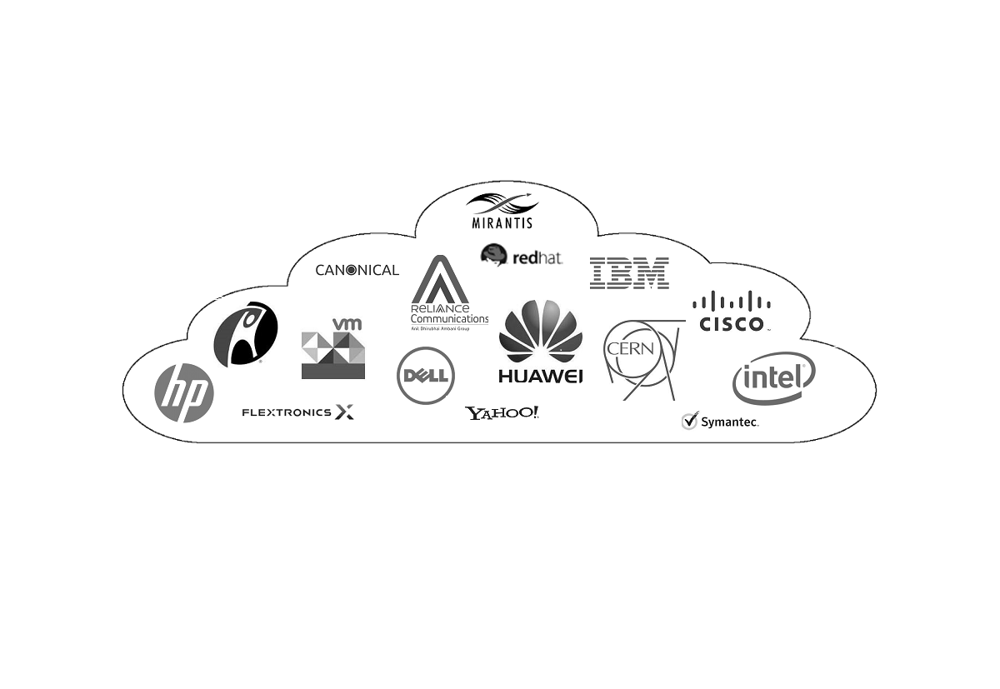
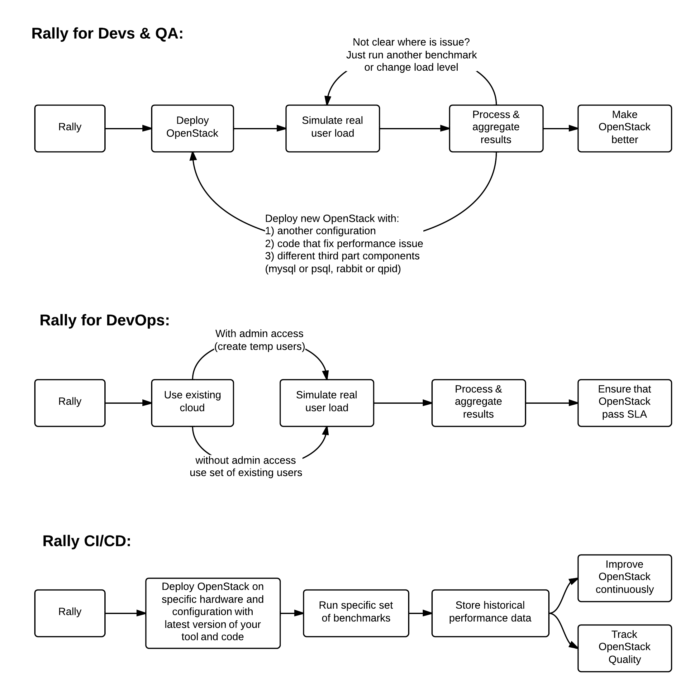

=====
Rally
=====

What is Rally
=============

Rally is a Benchmark-as-a-Service project for OpenStack.

Rally is intended to provide the community with a benchmarking tool that is capable of performing **specific**, **complicated** and **reproducible** test cases on **real deployment** scenarios.

If you are here, you are probably familiar with OpenStack and you also know that it's a really huge ecosystem of cooperative services. When something fails, performs slowly or doesn't scale, it's really hard to answer different questions on "what", "why" and "where" has happened. Another reason why you could be here is that you would like to build an OpenStack CI/CD system that will allow you to improve SLA, performance and stability of OpenStack continuously.

The OpenStack QA team mostly works on CI/CD that ensures that new patches don't break some specific single node installation of OpenStack. On the other hand it's clear that such CI/CD is only an indication and does not cover all cases (e.g. if a cloud works well on a single node installation it doesn't mean that it will continue to do so on a 1k servers installation under high load as well). Rally aims to fix this and help us to answer the question "How does OpenStack work at scale?". To make it possible, we are going to automate and unify all steps that are required for benchmarking OpenStack at scale: multi-node OS deployment, verification, benchmarking & profiling.

**Rally** workflow can be visualized by the following diagram:

.. image:: doc/source/images/Rally-Actions.png
   :alt: Rally Architecture

Who Is Using Rally
==================

Documentation
=============

`Rally documentation on ReadTheDocs <http://rally.readthedocs.org/en/latest/>`_ is a perfect place to start learning about Rally. It provides you with an **easy** and **illustrative** guidance through this benchmarking tool. For example, check out the `Rally step-by-step tutorial <http://rally.readthedocs.org/en/latest/tutorial.html>`_ that explains, in a series of lessons, how to explore the power of Rally in benchmarking your OpenStack clouds.

Architecture
------------

In terms of software architecture, Rally is built of 4 main components:

1. **Server Providers** - provide servers (virtual servers), with ssh access, in one L3 network.
2. **Deploy Engines** - deploy OpenStack cloud on servers that are presented by **Server Providers**
3. **Verification** - component that runs tempest (or another specific set of tests) against a deployed cloud, collects results & presents them in human readable form.
4. **Benchmark engine** - allows to write parameterized benchmark scenarios & run them against the cloud.

Use Cases
---------

There are 3 major high level Rally Use Cases:

Typical cases where Rally aims to help are:

- Automate measuring & profiling focused on how new code changes affect the OS performance;
- Using Rally profiler to detect scaling & performance issues;
- Investigate how different deployments affect the OS performance:
	- Find the set of suitable OpenStack deployment architectures;
	- Create deployment specifications for different loads (amount of controllers, swift nodes, etc.);
- Automate the search for hardware best suited for particular OpenStack cloud;
- Automate the production cloud specification generation:
	- Determine terminal loads for basic cloud operations: VM start & stop, Block Device create/destroy & various OpenStack API methods;
	- Check performance of basic cloud operations in case of different loads.

Links
----------------------

* Free software: Apache license
* Documentation: http://rally.readthedocs.org/en/latest/
* Source: http://git.openstack.org/cgit/openstack/rally
* Bugs: http://bugs.launchpad.net/rally
* Step-by-step tutorial: http://rally.readthedocs.org/en/latest/tutorial.html
* RoadMap: https://docs.google.com/a/mirantis.com/spreadsheets/d/16DXpfbqvlzMFaqaXAcJsBzzpowb_XpymaK2aFY2gA2g
* Launchpad page: https://launchpad.net/rally

