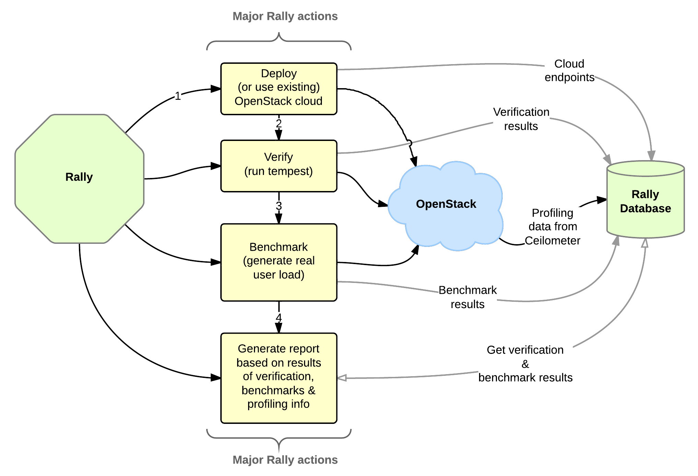

..
      Copyright 2015 Mirantis Inc. All Rights Reserved.

      Licensed under the Apache License, Version 2.0 (the "License"); you may
      not use this file except in compliance with the License. You may obtain
      a copy of the License at

          http://www.apache.org/licenses/LICENSE-2.0

      Unless required by applicable law or agreed to in writing, software
      distributed under the License is distributed on an "AS IS" BASIS, WITHOUT
      WARRANTIES OR CONDITIONS OF ANY KIND, either express or implied. See the
      License for the specific language governing permissions and limitations
      under the License.

What is Rally?
==============

**OpenStack** is, undoubtedly, a really *huge* ecosystem of cooperative services. **Rally** is a **benchmarking tool** that answers the question: **"How does OpenStack work at scale?"**. To make this possible, Rally **automates** and **unifies** multi-node OpenStack deployment, cloud verification, benchmarking & profiling. Rally does it in a **generic** way, making it possible to check whether OpenStack is going to work well on, say, a 1k-servers installation under high load. Thus it can be used as a basic tool for an *OpenStack CI/CD system* that would continuously improve its SLA, performance and stability.

Contents
--------
.. toctree::
   :maxdepth: 2

   overview
   glossary
   install
   tutorial
   cli/cli_reference
   reports
   user_stories
   plugins
   plugin/plugin_reference
   db_migrations
   contribute
   gates
   feature_requests
   project_info
   release_notes
