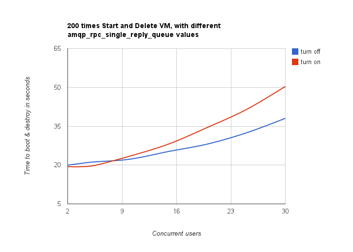
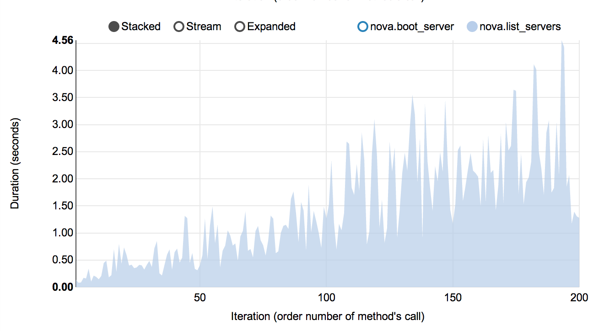
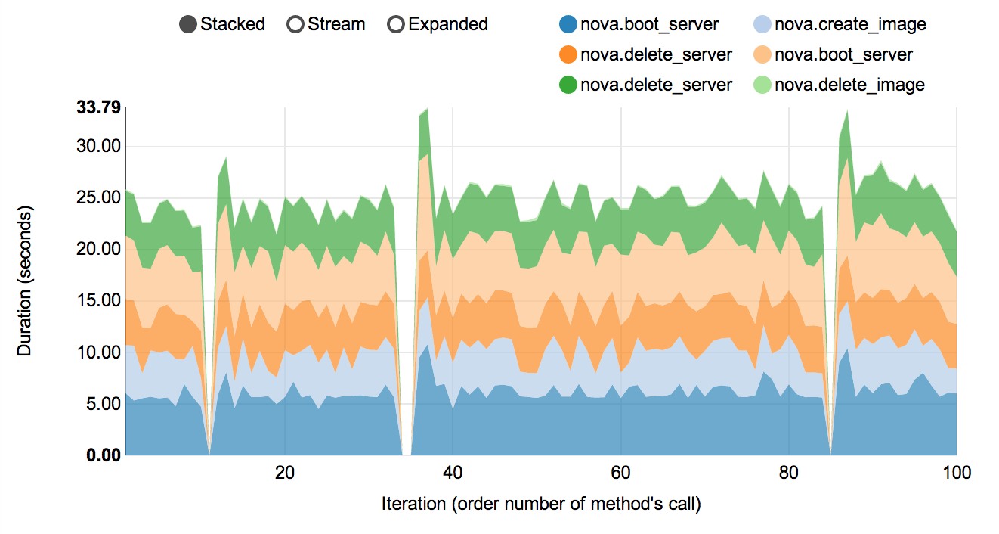
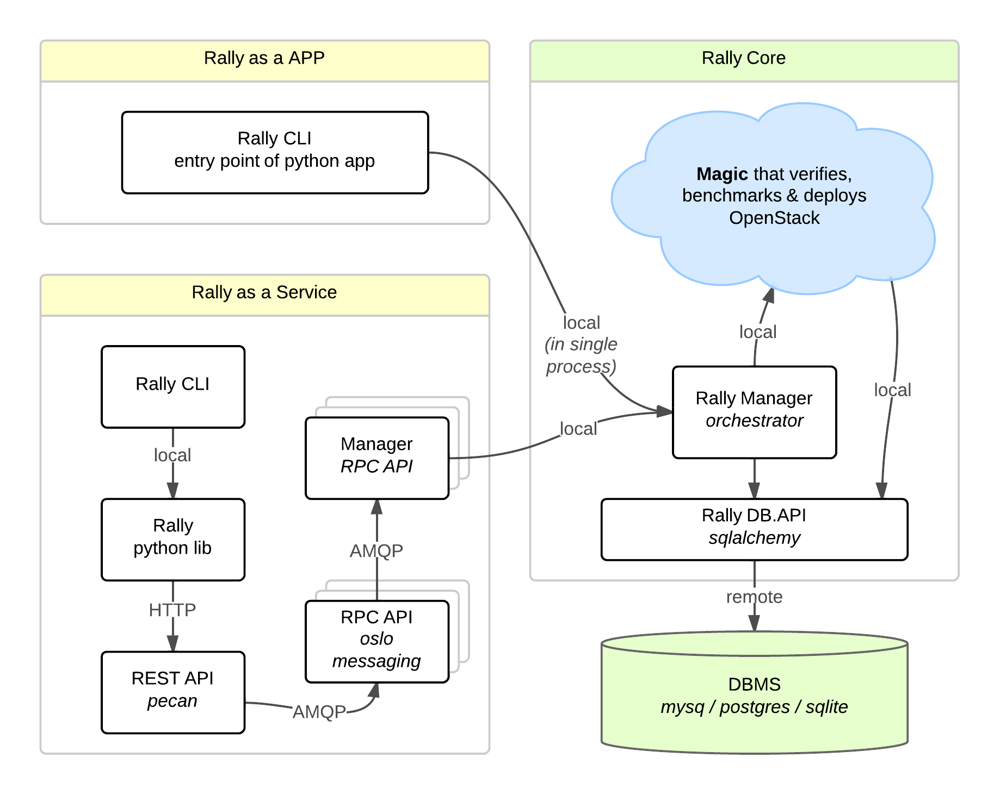
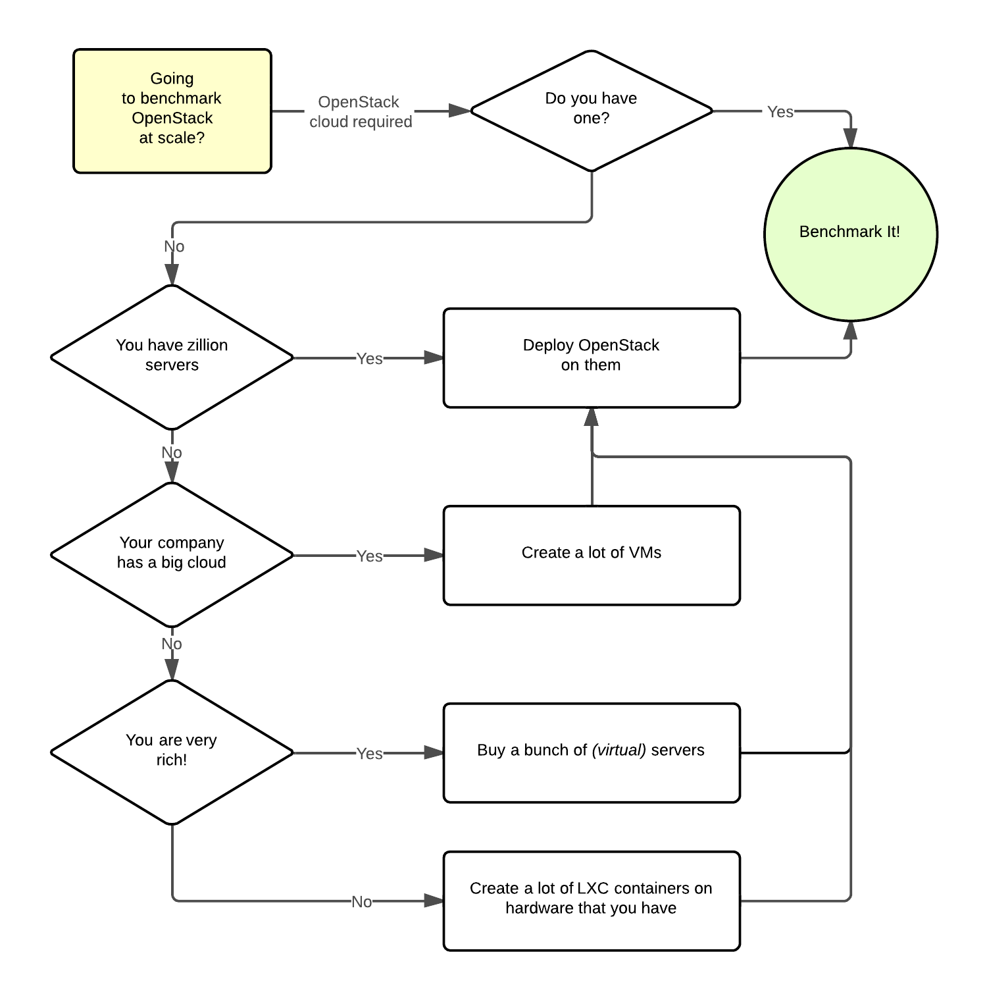

..
      Copyright 2015 Mirantis Inc. All Rights Reserved.

      Licensed under the Apache License, Version 2.0 (the "License"); you may
      not use this file except in compliance with the License. You may obtain
      a copy of the License at

          http://www.apache.org/licenses/LICENSE-2.0

      Unless required by applicable law or agreed to in writing, software
      distributed under the License is distributed on an "AS IS" BASIS, WITHOUT
      WARRANTIES OR CONDITIONS OF ANY KIND, either express or implied. See the
      License for the specific language governing permissions and limitations
      under the License.

.. _overview:

Overview
========

**Rally** is a **benchmarking tool** that **automates** and **unifies** multi-node OpenStack deployment, cloud verification, benchmarking & profiling. It can be used as a basic tool for an *OpenStack CI/CD system* that would continuously improve its SLA, performance and stability.

Who Is Using Rally
------------------

Here's a small selection of some of the many companies using Rally:

.. image:: ./images/Rally_who_is_using.png
   :align: center

Use Cases
---------

Let's take a look at 3 major high level Use Cases of Rally:

.. image:: ./images/Rally-UseCases.png
   :align: center

Generally, there are a few typical cases where Rally proves to be of great use:

    1. Automate measuring & profiling focused on how new code changes affect the OS performance;

    2. Using Rally profiler to detect scaling & performance issues;

    3. Investigate how different deployments affect the OS performance:

        * Find the set of suitable OpenStack deployment architectures;
        * Create deployment specifications for different loads (amount of controllers, swift nodes, etc.);

    4. Automate the search for hardware best suited for particular OpenStack cloud;

    5. Automate the production cloud specification generation:

        * Determine terminal loads for basic cloud operations: VM start & stop, Block Device create/destroy & various OpenStack API methods;
        * Check performance of basic cloud operations in case of different loads.

Real-life examples
------------------

To be substantive, let's investigate a couple of real-life examples of Rally in action.

How does amqp_rpc_single_reply_queue affect performance?
^^^^^^^^^^^^^^^^^^^^^^^^^^^^^^^^^^^^^^^^^^^^^^^^^^^^^^^^

Rally allowed us to reveal a quite an interesting fact about **Nova**. We used *NovaServers.boot_and_delete* benchmark scenario to see how the *amqp_rpc_single_reply_queue* option affects VM bootup time (it turns on a kind of fast RPC). Some time ago it was `shown <https://docs.google.com/file/d/0B-droFdkDaVhVzhsN3RKRlFLODQ/edit?pli=1>`_ that cloud performance can be boosted by setting it on, so we naturally decided to check this result with Rally. To make this test, we issued requests for booting and deleting VMs for a number of concurrent users ranging from 1 to 30 with and without the investigated option. For each group of users, a total number of 200 requests was issued. Averaged time per request is shown below:

**So Rally has unexpectedly indicated that setting the *amqp_rpc_single_reply_queue* option apparently affects the cloud performance, but in quite an opposite way rather than it was thought before.**

Performance of Nova list command
^^^^^^^^^^^^^^^^^^^^^^^^^^^^^^^^

Another interesting result comes from the *NovaServers.boot_and_list_server* scenario, which enabled us to we launched the following benchmark with Rally:

    * **Benchmark environment** (which we also call **"Context"**): 1 temporary OpenStack user.
    * **Benchmark scenario**: boot a single VM from this user & list all VMs.
    * **Benchmark runner** setting: repeat this procedure 200 times in a continuous way.

During the execution of this benchmark scenario, the user has more and more VMs on each iteration. Rally has shown that in this case, the performance of the **VM list** command in Nova is degrading much faster than one might expect:

Complex scenarios
^^^^^^^^^^^^^^^^^

In fact, the vast majority of Rally scenarios is expressed as a sequence of **"atomic" actions**. For example, *NovaServers.snapshot* is composed of 6 atomic actions:

    1. boot VM
    2. snapshot VM
    3. delete VM
    4. boot VM from snapshot
    5. delete VM
    6. delete snapshot

Rally measures not only the performance of the benchmark scenario as a whole, but also that of single atomic actions. As a result, Rally also plots the atomic actions performance data for each benchmark iteration in a quite detailed way:

Architecture
------------

Usually OpenStack projects are implemented *"as-a-Service"*, so Rally provides this approach. In addition, it implements a *CLI-driven* approach that does not require a daemon:

    1. **Rally as-a-Service**: Run rally as a set of daemons that present Web UI *(work in progress)* so 1 RaaS could be used by a whole team.
    2. **Rally as-an-App**: Rally as a just lightweight and portable CLI app (without any daemons) that makes it simple to use & develop.

The diagram below shows how this is possible:

The actual **Rally core** consists of 4 main components, listed below in the order they go into action:

    1. **Server Providers** - provide a **unified interface** for interaction with different **virtualization technologies** (*LXS*, *Virsh* etc.) and **cloud suppliers** (like *Amazon*): it does so via *ssh* access and in one *L3 network*;
    2. **Deploy Engines** - deploy some OpenStack distribution (like *DevStack* or *FUEL*) before any benchmarking procedures take place, using servers retrieved from Server Providers;
    3. **Verification** - runs *Tempest* (or another specific set of tests) against the deployed cloud to check that it works correctly, collects results & presents them in human readable form;
    4. **Benchmark Engine** - allows to write parameterized benchmark scenarios & run them against the cloud.

It should become fairly obvious why Rally core needs to be split to these parts if you take a look at the following diagram that visualizes a rough **algorithm for starting benchmarking OpenStack at scale**. Keep in mind that there might be lots of different ways to set up virtual servers, as well as to deploy OpenStack to them.

