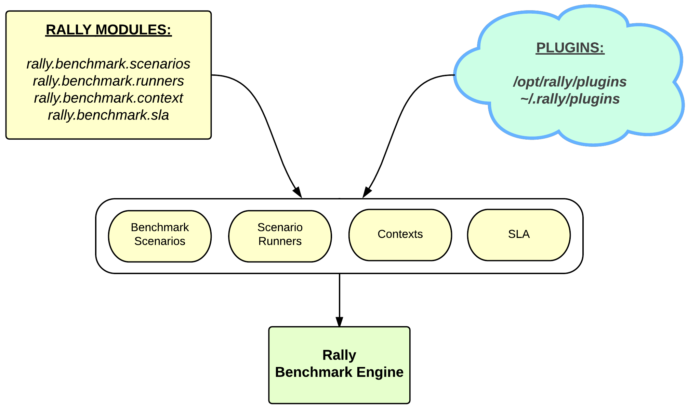

..
      Copyright 2015 Mirantis Inc. All Rights Reserved.

      Licensed under the Apache License, Version 2.0 (the "License"); you may
      not use this file except in compliance with the License. You may obtain
      a copy of the License at

          http://www.apache.org/licenses/LICENSE-2.0

      Unless required by applicable law or agreed to in writing, software
      distributed under the License is distributed on an "AS IS" BASIS, WITHOUT
      WARRANTIES OR CONDITIONS OF ANY KIND, either express or implied. See the
      License for the specific language governing permissions and limitations
      under the License.

.. _plugins:

Rally Plugins
=============

Rally Plugin Reference
----------------------

Rally has a plugin oriented architecture - in other words Rally team is trying
to make all places of code pluggable. Such architecture leads to the big amount
of plugins. :ref:`Rally Plugins Reference page <plugin_reference>` contains a
full list with detailed descriptions of all official Rally plugins.

How plugins work
----------------

Rally provides an opportunity to create and use a **custom benchmark
scenario, runner, SLA, deployment or context** as a **plugin**:

Placement
---------

Plugins can be quickly written and used, with no need to contribute
them to the actual Rally code. Just place a python module with your
plugin class into the ``/opt/rally/plugins`` or ``~/.rally/plugins``
directory (or its subdirectories), and it will be
autoloaded. Additional paths can be specified with the
``--plugin-paths`` argument, or with the ``RALLY_PLUGIN_PATHS``
environment variable, both of which accept comma-delimited
lists. Both ``--plugin-paths`` and ``RALLY_PLUGIN_PATHS`` can list
either plugin module files, or directories containing plugins. For
instance, both of these are valid:

.. code-block:: bash

    rally --plugin-paths /rally/plugins ...
    rally --plugin-paths /rally/plugins/foo.py,/rally/plugins/bar.py ...

You can also use a script ``unpack_plugins_samples.sh`` from
``samples/plugins`` which will automatically create the
``~/.rally/plugins`` directory.

How to create a plugin
----------------------

To create your own plugin you need to inherit your plugin class from
plugin.Plugin class or its subclasses. Also you need to decorate your class
with ``rally.task.scenario.configure``

.. code-block:: python

    from rally.task import scenario

    @scenario.configure(name="my_new_plugin_name")
    class MyNewPlugin(plugin.Plugin):
        pass

.. toctree::
   :glob:
   :maxdepth: 1

   plugins/**
