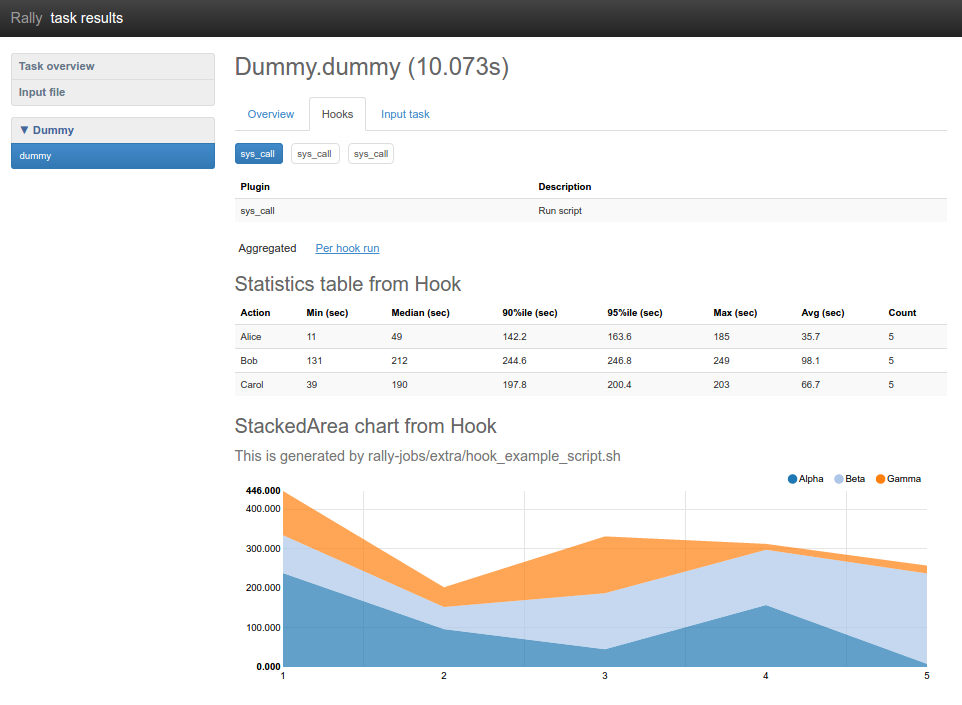
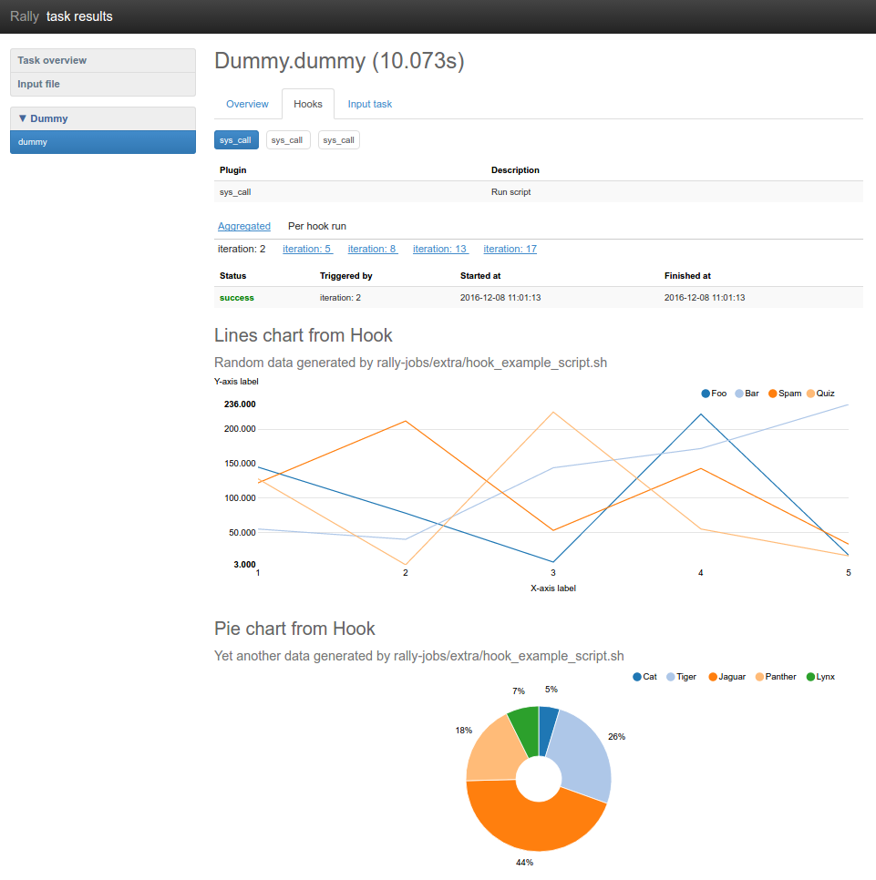
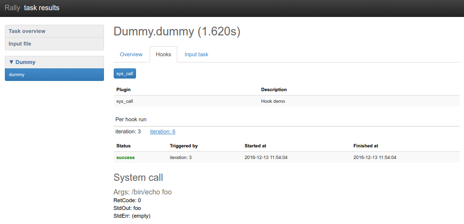

..
      Copyright 2016 Mirantis Inc. All Rights Reserved.

      Licensed under the Apache License, Version 2.0 (the "License"); you may
      not use this file except in compliance with the License. You may obtain
      a copy of the License at

          http://www.apache.org/licenses/LICENSE-2.0

      Unless required by applicable law or agreed to in writing, software
      distributed under the License is distributed on an "AS IS" BASIS, WITHOUT
      WARRANTIES OR CONDITIONS OF ANY KIND, either express or implied. See the
      License for the specific language governing permissions and limitations
      under the License.

.. _hook_and_trigger_plugins:

Hooks. Hook trigger plugins
===========================

Why Hooks?
----------

All Rally workloads repeat their actions as many times as it is configured by
runner. Once run, there is no way to interrupt the runner to evaluate any
change or restart event on the stability of the cloud under test.
For example we would like to test how configuration change or cloud component
restart would affect performance and stability.

Task hooks were added to fill this gap and allow to use Rally for reliability
and high availability testing. Generally, hooks allow to perform any
actions on specified iteration or specified time since the workload has been
started.

Also, task html-report provides results of hook execution. They can contain
graphical or textual information with timing and statistics.

Hooks & Triggers Overview
-------------------------

Architecture
^^^^^^^^^^^^

Rally uses runners to specify how many times the workload should be executed.
Hooks do not use runners, instead they rely on trigger plugins to specify when
and how many times hook should be called. Therefore hooks are isolated from
workload runners and do not affect them because each hook is executed in
separate thread.

Sample of usage
^^^^^^^^^^^^^^^

Hooks can be added to the task configuration. Lets take a look at hook
configuration:

.. code-block:: json

    {
        "name": "sys_call",
        "args": "/bin/echo 123",
        "trigger": {
            "name": "event",
            "args": {
                "unit": "iteration",
                "at": [5, 50, 200, 1000]
            }
        }
    }

It specifies hook plugin with name "sys_call". "args" field contains string
that will be used by sys_call plugin, but in case of any other hook plugin it
can contain any other Python object, that is assumed to be passed to the hook.
"trigger" field specifies which trigger plugin should be used to run this hook.
"trigger" contains similar fields "name" and "args" which represent trigger
plugin name and arguments for trigger plugin. In this example "event" trigger
is specified and configured to run the hook at 5th, 50th, 200th and 1000th
iterations.

Here is a full task config that contains previous hook configuration:

.. code-block:: json

  {
      "Dummy.dummy": [
          {
              "args": {
                  "sleep": 0.01
              },
              "runner": {
                  "type": "constant",
                  "times": 1500,
                  "concurrency": 1
              },
              "hooks": [
                  {
                      "name": "sys_call",
                      "args": "/bin/echo 123",
                      "trigger": {
                          "name": "event",
                          "args": {
                              "unit": "iteration",
                              "at": [5, 50, 200, 1000]
                          }
                      }
                  }
              ]
          }
      ]
  }

.. note::
    In this example, runner is configured to run workload 1500 times. So there
    is a limit for iterations and hook will be triggered only if certain
    iteration is started by runner. In other words, if trigger specifies
    iteration out of runner iterations scope then such trigger will not be
    called.

Task report for this example will contain minimal information about hook
execution: duration of each hook call and its status(success of failure).

Let's take a look at more complicated config that can produce graphical
and textual information.

.. code-block:: yaml

  ---
    Dummy.dummy:
      -
        args:
          sleep: 0.75
        runner:
          type: "constant"
          times: 20
          concurrency: 2
        hooks:
          - name: sys_call
            description: Run script
            args: sh rally/rally-jobs/extra/hook_example_script.sh
            trigger:
              name: event
              args:
                unit: iteration
                at: [2, 5, 8, 13, 17]
          - name: sys_call
            description: Show time
            args: date +%Y-%m-%dT%H:%M:%S
            trigger:
              name: event
              args:
                unit: time
                at: [0, 2, 5, 6, 9]
          - name: sys_call
            description: Show system name
            args: uname -a
            trigger:
              name: event
              args:
                unit: iteration
                at: [2, 3, 4, 5, 6, 8, 10, 12, 13, 15, 17, 18]
        sla:
          failure_rate:
            max: 0

hook_example_script.sh generates dummy output in JSON format. Graphical
information format is the same as for workloads and the same types of
charts are supported for the hooks.

Here is a report that shows aggregated table and chart with hook results:

Here is report that shows lines chart and pie chart for first hook on
the second iteration:

Browse existing Hooks_ and Triggers_.

Writing your own Hook plugin
----------------------------

Problem description
^^^^^^^^^^^^^^^^^^^

Hook plugin should implement custom action that can be done one or multiple
times during the workload. Examples of such actions might be the following:

- Destructive action inside cloud (`Fault Injection`_)
- Getting information about current state of cloud (load/health)
- Upgrading/downgrading a component of cloud
- Changing configuration of cloud
- etc.

Plugin code
^^^^^^^^^^^

The following example shows simple hook code that performs system call.
It is inherited from the base *Hook* class and contains implemented ``run()``
method:

.. code-block:: python

  import shlex
  import subprocess

  from rally import consts
  from rally.task import hook

  @hook.configure(name="simple_sys_call")
  class SimpleSysCallHook(hook.Hook):
      """Performs system call."""

      CONFIG_SCHEMA = {
          "$schema": consts.JSON_SCHEMA,
          "type": "string",
      }

      def run(self):
          proc = subprocess.Popen(shlex.split(self.config),
                                  stdout=subprocess.PIPE,
                                  stderr=subprocess.STDOUT)
          proc.wait()
          if proc.returncode:
              self.set_error(
                  exception_name="n/a",  # no exception class
                  description="Subprocess returned {}".format(proc.returncode),
                  details=proc.stdout.read(),
              )

Any exceptions risen during execution of ``run`` method will be caught by Hook
base class and saved as a result. Although hook should manually call
``Hook.set_error()`` to indicate logical error in case if there is no exception
raised.

Also there is a method for saving charts data: ``Hook.add_output()``.

Plugin Placement
^^^^^^^^^^^^^^^^

There are two folders for hook plugins:

- `OpenStack Hooks`_
- `Common Hooks`_

Sample of task that uses Hook
^^^^^^^^^^^^^^^^^^^^^^^^^^^^^

.. code-block:: json

  {
      "Dummy.dummy": [
          {
              "args": {
                  "sleep": 0.01
              },
              "runner": {
                  "type": "constant",
                  "times": 10,
                  "concurrency": 1
              },
              "hooks": [
                  {
                      "name": "simple_sys_call",
                      "args": "/bin/echo 123",
                      "trigger": {
                          "name": "event",
                          "args": {
                              "unit": "iteration",
                              "at": [3, 6]
                          }
                      }
                  }
              ]
          }
      ]
  }

Results of task execution
^^^^^^^^^^^^^^^^^^^^^^^^^

Result of previous task example:

Writing your own Trigger plugin
-------------------------------

Problem description
^^^^^^^^^^^^^^^^^^^

Trigger plugin should implement an event processor that decides whether to
start hook or not. Rally has two basic triggers that should cover most cases:

- `Event Trigger`_
- `Periodic Trigger`_

Plugin code
^^^^^^^^^^^

This example shows the code of the existing Event trigger:

.. code-block:: python

  from rally import consts
  from rally.task import trigger

  @trigger.configure(name="event")
  class EventTrigger(trigger.Trigger):
      """Triggers hook on specified event and list of values."""

      CONFIG_SCHEMA = {
          "type": "object",
          "$schema": consts.JSON_SCHEMA,
          "oneOf": [
              {
                  "properties": {
                      "unit": {"enum": ["time"]},
                      "at": {
                          "type": "array",
                          "minItems": 1,
                          "uniqueItems": True,
                          "items": {
                              "type": "integer",
                              "minimum": 0,
                          }
                      },
                  },
                  "required": ["unit", "at"],
                  "additionalProperties": False,
              },
              {
                  "properties": {
                      "unit": {"enum": ["iteration"]},
                      "at": {
                          "type": "array",
                          "minItems": 1,
                          "uniqueItems": True,
                          "items": {
                              "type": "integer",
                              "minimum": 1,
                          }
                      },
                  },
                  "required": ["unit", "at"],
                  "additionalProperties": False,
              },
          ]
      }

      def get_listening_event(self):
          return self.config["unit"]

      def on_event(self, event_type, value=None):
          if not (event_type == self.get_listening_event()
                  and value in self.config["at"]):
              # do nothing
              return
          super(EventTrigger, self).on_event(event_type, value)

Trigger plugins must override two methods:

- ``get_listening_event`` - this method should return currently configured
  event name. (So far Rally supports only "time" and "iteration")
- ``on_event`` - this method is called each time certain events occur.
  It calls base method when the hook is triggered on specified event.

Plugin Placement
^^^^^^^^^^^^^^^^

All trigger plugins should be placed in `Trigger folder`_.

.. references:

.. _Hooks: ../plugin_reference.html#task-hooks
.. _Triggers: ../plugin_reference.html#task-hook-triggers
.. _Fault Injection: ../plugin_reference.html#fault-injection-hook
.. _Event Trigger: ../plugin_reference.html#event-hook-trigger
.. _Periodic Trigger: ../plugin_reference.html#periodic-hook-trigger
.. _Common Hooks: https://github.com/openstack/rally/tree/master/rally/plugins/common/hook
.. _OpenStack Hooks: https://github.com/openstack/rally/tree/master/rally/plugins/openstack/hook
.. _Trigger folder: https://github.com/openstack/rally/tree/master/rally/plugins/common/trigger
