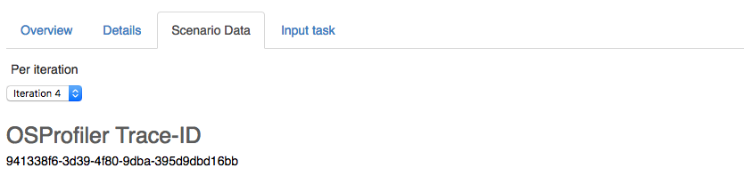

..
      Copyright 2017 Inria All Rights Reserved.

      Licensed under the Apache License, Version 2.0 (the "License"); you may
      not use this file except in compliance with the License. You may obtain
      a copy of the License at

          http://www.apache.org/licenses/LICENSE-2.0

      Unless required by applicable law or agreed to in writing, software
      distributed under the License is distributed on an "AS IS" BASIS, WITHOUT
      WARRANTIES OR CONDITIONS OF ANY KIND, either express or implied. See the
      License for the specific language governing permissions and limitations
      under the License.

.. _tutorial_step_10_profiling_openstack_internals:

Step 10. Profiling OpenStack Internals
======================================

.. contents::
   :local:

Rally leverage `OSprofiler <https://github.com/openstack/osprofiler>`_ to
generate traces of OpenStack internal calls happening during the run of a
scenario.  Integration of OSProfiler in Rally can help to dig into concurrency
problems of OpenStack which is a huge ecosystem of cooperative services.

Workflow
--------

Enabling the profiler is based on a shared secret between the clients (here
Rally) and the various Openstack services : the HMAC key.  In the following we
assume that your OpenStack services have been configured to enable OSprofiler
and that the secret HMAC key is ``SECRET_KEY``. This key is stored alongside
the credentials of your deployment. Once Rally is instructed about the HMAC
key, a new trace can be initialized for each iteration of the workload. Rally
will then store in its reports a profiler trace id. This id can be finally
used to query OSprofiler in order to get the full trace of the iteration.

Registering the HMAC key
------------------------

You can store your HMAC key in the environment variable
``OSPROFILER_HMAC_KEY``.  This variable will be loaded if you create your
deployment with the ``--from-env`` option.

Alternatively if you create your deployment using the ``--file`` option you can
add the HMAC key with the following :

.. code-block:: json

    {
      "openstack": {
        [...]
        "profiler_hmac_key": "SECRET_KEY"
      }
    }

Getting the full trace
----------------------

A trace id is stored on a per-iteration basis and can be found in the JSON
report as-well as the HTML report :

OSProfiler can be asked to generate the full trace using this trace id:

.. code-block:: shell

    osprofiler trace show --html --out trace.html 941338f6-3d39-4f80-9dba-395d9dbd16bb

Disabling the profiler
----------------------

Setting ``enable_profiler = False`` under the ``benchmark`` group in the
configuration file will disabled the profiler.
