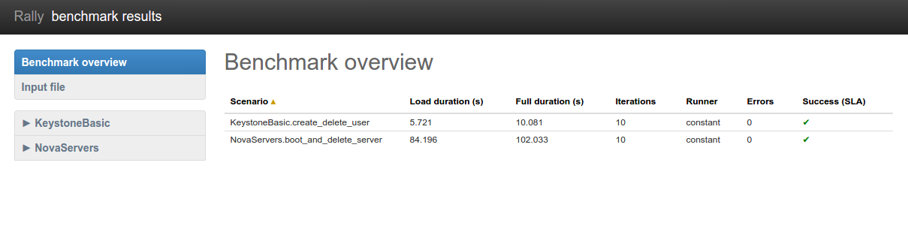
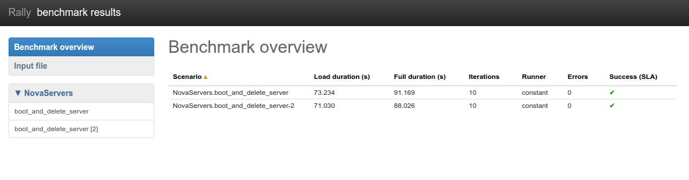

..
      Copyright 2015 Mirantis Inc. All Rights Reserved.

      Licensed under the Apache License, Version 2.0 (the "License"); you may
      not use this file except in compliance with the License. You may obtain
      a copy of the License at

          http://www.apache.org/licenses/LICENSE-2.0

      Unless required by applicable law or agreed to in writing, software
      distributed under the License is distributed on an "AS IS" BASIS, WITHOUT
      WARRANTIES OR CONDITIONS OF ANY KIND, either express or implied. See the
      License for the specific language governing permissions and limitations
      under the License.

.. _tutorial_step_2_input_task_format:

Step 2. Rally input task format
===============================

.. contents::
   :local:

Basic input task syntax
-----------------------

Rally comes with a really great collection of
:ref:`plugins <tutorial_step_8_discovering_more_plugins>` and in most
real-world cases you will use multiple plugins to test your OpenStack cloud.
Rally makes it very easy to run **different test cases defined in a single
task**. To do so, use the following syntax:

.. code-block:: json

    {
        "<ScenarioName1>": [<benchmark_config>, <benchmark_config2>, ...]
        "<ScenarioName2>": [<benchmark_config>, ...]
    }

where *<benchmark_config>*, as before, is a dictionary:

.. code-block:: json

    {
        "args": { <scenario-specific arguments> },
        "runner": { <type of the runner and its specific parameters> },
        "context": { <contexts needed for this scenario> },
        "sla": { <different SLA configs> }
    }

Multiple benchmarks in a single task
------------------------------------

As an example, let's edit our configuration file from
:ref:`step 1 <tutorial_step_1_setting_up_env_and_running_benchmark_from_samples>`
so that it prescribes Rally to launch not only the
**NovaServers.boot_and_delete_server** scenario, but also the
**KeystoneBasic.create_delete_user** scenario. All we have to do is to append
the configuration of the second scenario as yet another top-level key of our
JSON file:

*multiple-scenarios.json*

.. code-block:: json

    {
        "NovaServers.boot_and_delete_server": [
            {
                "args": {
                    "flavor": {
                        "name": "m1.tiny"
                    },
                    "image": {
                        "name": "^cirros.*uec$"
                    },
                    "force_delete": false
                },
                "runner": {
                    "type": "constant",
                    "times": 10,
                    "concurrency": 2
                },
                "context": {
                    "users": {
                        "tenants": 3,
                        "users_per_tenant": 2
                    }
                }
            }
        ],
        "KeystoneBasic.create_delete_user": [
            {
                "args": {},
                "runner": {
                    "type": "constant",
                    "times": 10,
                    "concurrency": 3
                }
            }
        ]
    }

Now you can start this benchmark task as usually:

.. code-block:: console

    $ rally task start multiple-scenarios.json
    ...
    +--------------------+-----------+-----------+-----------+---------------+---------------+---------+-------+
    | action             | min (sec) | avg (sec) | max (sec) | 90 percentile | 95 percentile | success | count |
    +--------------------+-----------+-----------+-----------+---------------+---------------+---------+-------+
    | nova.boot_server   | 8.06      | 11.354    | 18.594    | 18.54         | 18.567        | 100.0%  | 10    |
    | nova.delete_server | 4.364     | 5.054     | 6.837     | 6.805         | 6.821         | 100.0%  | 10    |
    | total              | 12.572    | 16.408    | 25.396    | 25.374        | 25.385        | 100.0%  | 10    |
    +--------------------+-----------+-----------+-----------+---------------+---------------+---------+-------+
    Load duration: 84.1959171295
    Full duration: 102.033041
    --------------------------------------------------------------------------------

    ...

    +----------------------+-----------+-----------+-----------+---------------+---------------+---------+-------+
    | action               | min (sec) | avg (sec) | max (sec) | 90 percentile | 95 percentile | success | count |
    +----------------------+-----------+-----------+-----------+---------------+---------------+---------+-------+
    | keystone.create_user | 0.676     | 0.875     | 1.03      | 1.02          | 1.025         | 100.0%  | 10    |
    | keystone.delete_user | 0.407     | 0.647     | 0.84      | 0.739         | 0.79          | 100.0%  | 10    |
    | total                | 1.082     | 1.522     | 1.757     | 1.724         | 1.741         | 100.0%  | 10    |
    +----------------------+-----------+-----------+-----------+---------------+---------------+---------+-------+
    Load duration: 5.72119688988
    Full duration: 10.0808410645

    ...

Note that the HTML reports you can generate by typing **rally task report
--out=report_name.html** after your benchmark task has completed will get
richer as your benchmark task configuration file includes more benchmark
scenarios. Let's take a look at the report overview page for a task that covers
all the scenarios available in Rally:

.. code-block:: bash

   rally task report --out=report_multiple_scenarios.html --open

Multiple configurations of the same scenario
--------------------------------------------

Yet another thing you can do in Rally is to launch **the same benchmark
scenario multiple times with different configurations**. That's why our
configuration file stores a list for the key
*"NovaServers.boot_and_delete_server"*: you can just append a different
configuration of this benchmark scenario to this list to get it. Let's say,
you want to run the **boot_and_delete_server** scenario twice: first using the
*"m1.tiny"* flavor and then using the *"m1.small"* flavor:

*multiple-configurations.json*

.. code-block:: json

    {
        "NovaServers.boot_and_delete_server": [
            {
                "args": {
                    "flavor": {
                        "name": "m1.tiny"
                    },
                    "image": {
                        "name": "^cirros.*uec$"
                    },
                    "force_delete": false
                },
                "runner": {...},
                "context": {...}
            },
            {
                "args": {
                    "flavor": {
                        "name": "m1.small"
                    },
                    "image": {
                        "name": "^cirros.*uec$"
                    },
                    "force_delete": false
                },
                "runner": {...},
                "context": {...}
            }
        ]
    }

That's it! You will get again the results for each configuration separately:

.. code-block:: console

    $ rally task start --task=multiple-configurations.json
    ...
    +--------------------+-----------+-----------+-----------+---------------+---------------+---------+-------+
    | action             | min (sec) | avg (sec) | max (sec) | 90 percentile | 95 percentile | success | count |
    +--------------------+-----------+-----------+-----------+---------------+---------------+---------+-------+
    | nova.boot_server   | 7.896     | 9.433     | 13.14     | 11.329        | 12.234        | 100.0%  | 10    |
    | nova.delete_server | 4.435     | 4.898     | 6.975     | 5.144         | 6.059         | 100.0%  | 10    |
    | total              | 12.404    | 14.331    | 17.979    | 16.72         | 17.349        | 100.0%  | 10    |
    +--------------------+-----------+-----------+-----------+---------------+---------------+---------+-------+
    Load duration: 73.2339417934
    Full duration: 91.1692159176
    --------------------------------------------------------------------------------

    ...

    +--------------------+-----------+-----------+-----------+---------------+---------------+---------+-------+
    | action             | min (sec) | avg (sec) | max (sec) | 90 percentile | 95 percentile | success | count |
    +--------------------+-----------+-----------+-----------+---------------+---------------+---------+-------+
    | nova.boot_server   | 8.207     | 8.91      | 9.823     | 9.692         | 9.758         | 100.0%  | 10    |
    | nova.delete_server | 4.405     | 4.767     | 6.477     | 4.904         | 5.691         | 100.0%  | 10    |
    | total              | 12.735    | 13.677    | 16.301    | 14.596        | 15.449        | 100.0%  | 10    |
    +--------------------+-----------+-----------+-----------+---------------+---------------+---------+-------+
    Load duration: 71.029528141
    Full duration: 88.0259010792
    ...

The HTML report will also look similar to what we have seen before:

.. code-block:: bash

   rally task report --out=report_multiple_configuraions.html --open

