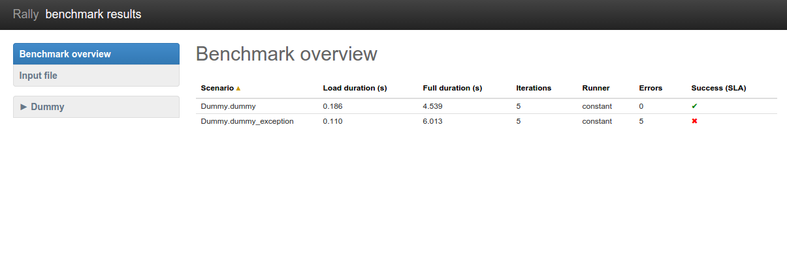
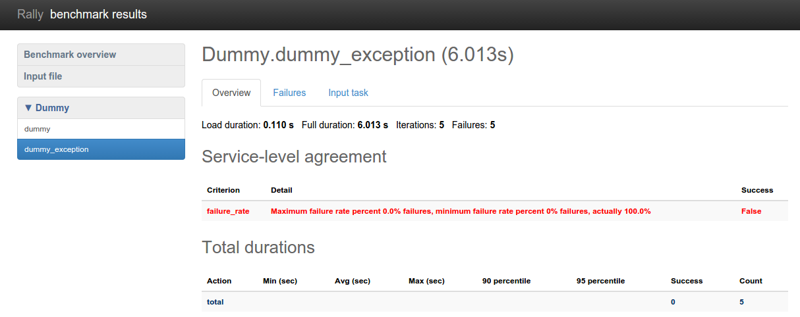

..
      Copyright 2015 Mirantis Inc. All Rights Reserved.

      Licensed under the Apache License, Version 2.0 (the "License"); you may
      not use this file except in compliance with the License. You may obtain
      a copy of the License at

          http://www.apache.org/licenses/LICENSE-2.0

      Unless required by applicable law or agreed to in writing, software
      distributed under the License is distributed on an "AS IS" BASIS, WITHOUT
      WARRANTIES OR CONDITIONS OF ANY KIND, either express or implied. See the
      License for the specific language governing permissions and limitations
      under the License.

.. _tutorial_step_4_adding_success_criteria_for_benchmarks:

Step 4. Adding success criteria (SLA) for benchmarks
====================================================

.. contents::
   :local:

SLA - Service-Level Agreement (Success Criteria)
------------------------------------------------

Rally allows you to set success criteria (also called *SLA - Service-Level
Agreement*) for every benchmark. Rally will automatically check them for you.

To configure the SLA, add the *"sla"* section to the configuration of the
corresponding benchmark (the check name is a key associated with its target
value). You can combine different success criteria:

.. code-block:: json

    {
        "NovaServers.boot_and_delete_server": [
            {
                "args": {
                    ...
                },
                "runner": {
                    ...
                },
                "context": {
                    ...
                },
                "sla": {
                    "max_seconds_per_iteration": 10,
                    "failure_rate": {
                        "max": 25
                    }
                }
            }
        ]
    }

Such configuration will mark the **NovaServers.boot_and_delete_server**
benchmark scenario as not successful if either some iteration took more than 10
seconds or more than 25% iterations failed.

Checking SLA
------------
Let us show you how Rally SLA work using a simple example based on **Dummy
benchmark scenarios**. These scenarios actually do not perform any
OpenStack-related stuff but are very useful for testing the behaviors of Rally.
Let us put in a new task, *test-sla.json*, 2 scenarios -- one that does nothing
and another that just throws an exception:

.. code-block:: json

    {
        "Dummy.dummy": [
            {
                "args": {},
                "runner": {
                    "type": "constant",
                    "times": 5,
                    "concurrency": 2
                },
                "context": {
                    "users": {
                        "tenants": 3,
                        "users_per_tenant": 2
                    }
                },
                "sla": {
                    "failure_rate": {"max": 0.0}
                }
            }
        ],
        "Dummy.dummy_exception": [
            {
                "args": {},
                "runner": {
                    "type": "constant",
                    "times": 5,
                    "concurrency": 2
                },
                "context": {
                    "users": {
                        "tenants": 3,
                        "users_per_tenant": 2
                    }
                },
                "sla": {
                    "failure_rate": {"max": 0.0}
                }
            }
        ]
    }

Note that both scenarios in these tasks have the **maximum failure rate of 0%**
as their **success criterion**. We expect that the first scenario will pass
this criterion while the second will fail it. Let's start the task:

.. code-block:: bash

   rally task start test-sla.json

After the task completes, run *rally task sla_check* to check the results again
the success criteria you defined in the task:

.. code-block:: console

   $ rally task sla_check
   +-----------------------+-----+--------------+--------+-------------------------------------------------------------------------------------------------------+
   | benchmark             | pos | criterion    | status | detail                                                                                                |
   +-----------------------+-----+--------------+--------+-------------------------------------------------------------------------------------------------------+
   | Dummy.dummy           | 0   | failure_rate | PASS   | Maximum failure rate percent 0.0% failures, minimum failure rate percent 0% failures, actually 0.0%   |
   | Dummy.dummy_exception | 0   | failure_rate | FAIL   | Maximum failure rate percent 0.0% failures, minimum failure rate percent 0% failures, actually 100.0% |
   +-----------------------+-----+--------------+--------+-------------------------------------------------------------------------------------------------------+

Exactly as expected.

SLA in task report
------------------

SLA checks are nicely visualized in task reports. Generate one:

.. code-block:: bash

   rally task report --out=report_sla.html --open

Benchmark scenarios that have passed SLA have a green check on the overview
page:

Somewhat more detailed information about SLA is displayed on the scenario
pages:

Success criteria present a very useful concept that enables not only to analyze
the outcome of your benchmark tasks, but also to control their execution. In
:ref:`one of the next sections <tutorial_step_6_aborting_load_generation_on_sla_failure>`
of our tutorial, we will show how to use SLA to abort the load generation before
your OpenStack goes wrong.
