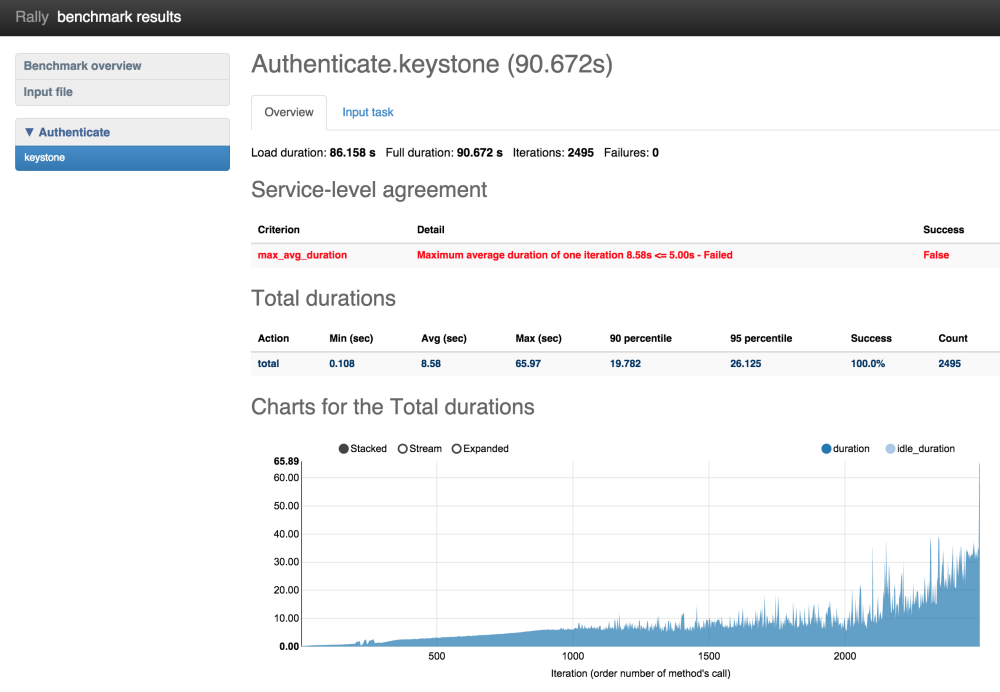
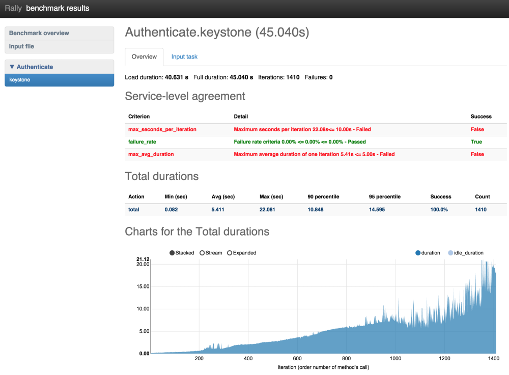

..
      Copyright 2015 Mirantis Inc. All Rights Reserved.

      Licensed under the Apache License, Version 2.0 (the "License"); you may
      not use this file except in compliance with the License. You may obtain
      a copy of the License at

          http://www.apache.org/licenses/LICENSE-2.0

      Unless required by applicable law or agreed to in writing, software
      distributed under the License is distributed on an "AS IS" BASIS, WITHOUT
      WARRANTIES OR CONDITIONS OF ANY KIND, either express or implied. See the
      License for the specific language governing permissions and limitations
      under the License.

.. _tutorial_step_6_aborting_load_generation_on_sla_failure:

Step 6. Aborting load generation on success criteria failure
============================================================

Benchmarking pre-production and production OpenStack clouds is not a trivial
task. From the one side it is important to reach the OpenStack cloud’s limits,
from the other side the cloud shouldn't be damaged. Rally aims to make this
task as simple as possible. Since the very beginning Rally was able to generate
enough load for any OpenStack cloud. Generating too big a load was the major
issue for production clouds, because Rally didn't know how to stop the load
until it was too late.

With the **"stop on SLA failure"** feature, however, things are much better.

This feature can be easily tested in real life by running one of the most
important and plain benchmark scenario called *"Authenticate.keystone"*. This
scenario just tries to authenticate from users that were pre-created by Rally.
Rally input task looks as follows (*auth.yaml*):

.. code-block:: yaml

    ---
      Authenticate.keystone:
      -
        runner:
          type: "rps"
          times: 6000
          rps: 50
        context:
          users:
            tenants: 5
            users_per_tenant: 10
        sla:
          max_avg_duration: 5

In human-readable form this input task means: *Create 5 tenants with 10 users
in each, after that try to authenticate to Keystone 6000 times performing 50
authentications per second (running new authentication request every 20ms).
Each time we are performing authentication from one of the Rally pre-created
user. This task passes only if max average duration of authentication takes
less than 5 seconds.*

**Note that this test is quite dangerous because it can DDoS Keystone**. We are
running more and more simultaneously authentication requests and things may go
wrong if something is not set properly (like on my DevStack deployment in Small
VM on my laptop).

Let’s run Rally task with **an argument that prescribes Rally to stop load on
SLA failure**:

.. code-block:: console

    $ rally task start --abort-on-sla-failure auth.yaml

    ....
    +--------+-----------+-----------+-----------+---------------+---------------+---------+-------+
    | action | min (sec) | avg (sec) | max (sec) | 90 percentile | 95 percentile | success | count |
    +--------+-----------+-----------+-----------+---------------+---------------+---------+-------+
    | total  | 0.108     | 8.58      | 65.97     | 19.782        | 26.125        | 100.0%  | 2495  |
    +--------+-----------+-----------+-----------+---------------+---------------+---------+-------+

On the resulting table there are 2 interesting things:

1. Average duration was 8.58 sec which is more than 5 seconds
2. Rally performed only 2495 (instead of 6000) authentication requests

To understand better what has happened let’s generate HTML report:

.. code-block:: bash

    rally task report --out auth_report.html

On the chart with durations we can observe that the duration of authentication
request reaches 65 seconds at the end of the load generation. **Rally stopped
load at the very last moment just before bad things happened. The reason why it
runs so many attempts to authenticate is because of not enough good success
criteria.** We had to run a lot of iterations to make average duration bigger
than 5 seconds. Let’s chose better success criteria for this task and run it
one more time.

.. code-block:: yaml

    ---
      Authenticate.keystone:
      -
        runner:
          type: "rps"
          times: 6000
          rps: 50
        context:
          users:
            tenants: 5
            users_per_tenant: 10
        sla:
          max_avg_duration: 5
          max_seconds_per_iteration: 10
          failure_rate:
            max: 0

Now our task is going to be successful if the following three conditions hold:

1. maximum average duration of authentication should be less than 5 seconds
2. maximum duration of any authentication should be less than 10 seconds
3. no failed authentication should appear

Let’s run it!

.. code-block:: console

    $ rally task start --abort-on-sla-failure auth.yaml

    ...
    +--------+-----------+-----------+-----------+---------------+---------------+---------+-------+
    | action | min (sec) | avg (sec) | max (sec) | 90 percentile | 95 percentile | success | count |
    +--------+-----------+-----------+-----------+---------------+---------------+---------+-------+
    | total  | 0.082     | 5.411     | 22.081    | 10.848        | 14.595        | 100.0%  | 1410  |
    +--------+-----------+-----------+-----------+---------------+---------------+---------+-------+

This time load stopped after 1410 iterations versus 2495 which is much better.
The interesting thing on this chart is that first occurrence of “> 10 second”
authentication happened on 950 iteration. The reasonable question: “Why does
Rally run 500 more authentication requests then?”. This appears from the math:
During the execution of **bad** authentication (10 seconds) Rally performed
about 50 request/sec * 10 sec = 500 new requests as a result we run 1400
iterations instead of 950.

(based on: http://boris-42.me/rally-tricks-stop-load-before-your-openstack-goes-wrong/)
