:tocdepth: 1

============
HTML Reports
============

HTML reports provide comprehensive analysis.
Data is structured and displayed interactively, with charts and tables.

.. contents::
  :depth: 2
  :local:

Task Report
===========

Get the whole information about task workloads results, in pretty
and convenient format!

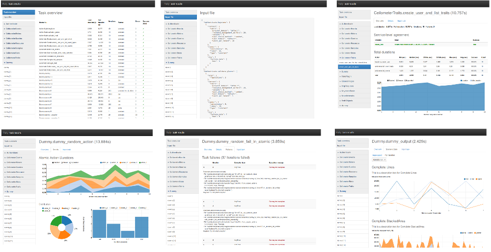

Generate report for single task, using task UUID
------------------------------------------------

Having a finished task, generate report with command:

.. code-block:: shell

  $ rally task report <task-uuid> --out <report-file>

Example:

.. code-block:: shell

  $ rally task report 6f63d9ec-eecd-4696-8e9c-2ba065c68535 --out report.html

Generate report for single task, using JSON file
------------------------------------------------

Report can be generated from a task results JSON file.
This file can be generated with command *rally task results*:

.. code-block:: shell

  $ rally task results 6f63d9ec-eecd-4696-8e9c-2ba065c68535 > results.json
  $ rally task report results.json --out report.html

Generate report for many tasks
------------------------------

Report can be generated from many tasks. All workloads from specified
tasks results will be composed into an entire report.
To generate report, use *--tasks* argument with specified list of tasks UUIDs
and/or tasks results JSON files.

Example:

.. code-block:: shell

  $ rally task report --tasks 6f63d9ec-eecd-4696-8e9c-2ba065c68535 20ae7e95-7395-4be4-aec2-b89220adee60 a5737eba-a204-43d6-a262-d5ea4b0065da results.json another_results.json --out report.html

Task Overview
-------------

This is a table with brief summary of all workloads results.
All columns are sortable and clickable.

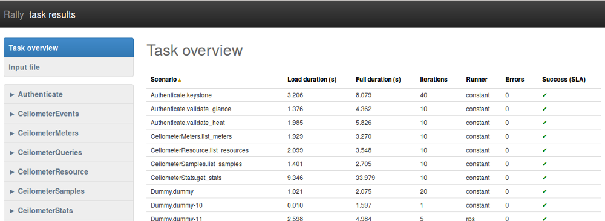

Load duration
~~~~~~~~~~~~~

Time from first iteration start to last iteration end.
In other words, this is a time of all workload iterations execution.

Full duration
~~~~~~~~~~~~~

This time includes iterations time (`Load duration <#load-duration>`_)
plus time taken by another actions related to the task, mostly Contexts
excecution time.

Iterations
~~~~~~~~~~

How many times the workload has run. This comes from the value of *runner.times* in task input file.

Failures
~~~~~~~~

Number of failed iterations.
Failure means that there was an Exception raised.

Success (SLA)
~~~~~~~~~~~~~

This is a boolean result of workload SLA. See `Service-level agreement explanation <#id2>`_ below.

Input file
----------

This shows JSON which can be used to run a task with exactly the same workloads list and configuration.
This is not an exact copy (neither concatenation) of actually used input files (in command *rally task start*), however this is exactly what is needed to run workloads given in the report.

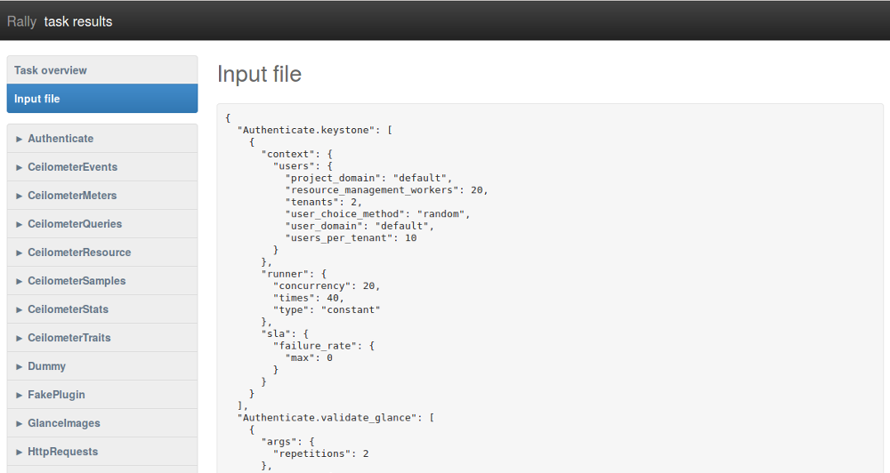

Tab «Overview»
--------------

Service-level agreement
~~~~~~~~~~~~~~~~~~~~~~~

`SLA <https://en.wikipedia.org/wiki/Service-level_agreement>`_ results appear
in task report only if *"sla"* section is defined in task input file.

For example, having this in task input file:

.. code-block:: json

  "sla": {
    "performance_degradation": {
      "max_degradation": 50
    },
    "max_seconds_per_iteration": 1.0,
    "failure_rate": {
      "max": 0
    },
    "outliers": {
      "max": 1,
      "min_iterations": 10,
      "sigmas": 10
    },
    "max_avg_duration": 0.5
  }

will result SLA section similar to the following:

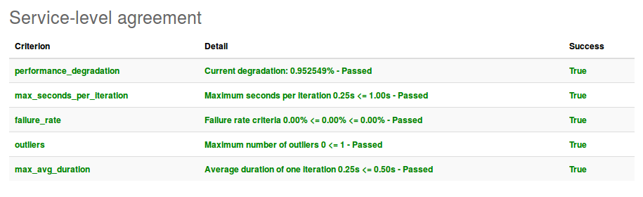

What if workload has no "sla" configuration in input file?
~~~~~~~~~~~~~~~~~~~~~~~~~~~~~~~~~~~~~~~~~~~~~~~~~~~~~~~~~~

If *"sla"* section is missed in input file, then block *Service-level agreement*
is not displayed and its result is assumed to be always passed
(no matter how many failures occured).

Total durations
~~~~~~~~~~~~~~~

There is a durations analysis, which is is represented by statistics table and duration StackedArea chart.

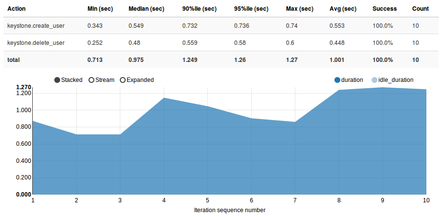

Table with statistics data
++++++++++++++++++++++++++

**Action**
 Name of the workload metric that has some duration saved.
 This is either an atomic action name or *Total* which points to workload `load duration <#load-duration>`_.

**Min (sec)**
 `Minimal <https://en.wikipedia.org/wiki/Maxima_and_minima>`_ duration value

**Median (sec)**
 `Median <https://en.wikipedia.org/wiki/Median>`_ duration value

**90%ile (sec)**
 `Percentile <https://en.wikipedia.org/wiki/Percentile>`_ for 90% durations

**95%ile (sec)**
 `Percentile <https://en.wikipedia.org/wiki/Percentile>`_ for 95% durations

**Max (sec)**
 `Maximal <https://en.wikipedia.org/wiki/Maxima_and_minima>`_ duration value

**Avg (sec)**
 `Average <https://en.wikipedia.org/wiki/Average>`_ duration value

**Success**
 Percent of successful runs. This is how many percent of this action runs
 (number of runs is given in *Count* column) were successful.

**Count**
 Number of actually run atomic actions. This can differ from `iterations count <#iterations>`_
 because some atomic actions do not start if some exception is raised
 before in the workload runtime (for example in previous atomic action).

StackedArea with durations per iteration
++++++++++++++++++++++++++++++++++++++++

This chart shows `load_duration <#load-duration>`_ and `idle_duration <#id5>`_ values per iteration.
If there is only one iteration, then chart is useless so it is hidden.

Idle duration
+++++++++++++

Sometimes workload does nothing for some reason (waiting for something or just making a dummy load).
This is achieved by calling *time.sleep()* and spent time is called *idle duration*.

Load Profile
~~~~~~~~~~~~

`Load profile <https://en.wikipedia.org/wiki/Load_profile>`_ chart shows number
of iterations running in parallel for each workload moment

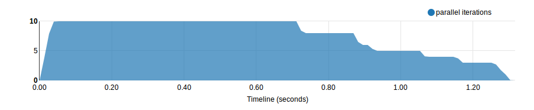

Distribution
~~~~~~~~~~~~

Pie chart shows percent of successful and failed `iterations <#iterations>`_.

Histogram shows durations distribution with the following
`methods <https://en.wikipedia.org/wiki/Histogram>`_ (selected in dropdown list):
**Square Root Choice**, **Sturges Formula**, **Rise Rule**

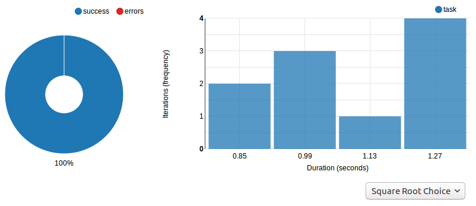

Tab «Details»
-------------

Atomic Action Durations
~~~~~~~~~~~~~~~~~~~~~~~

There is a StackedArea chart that shows atomic actions durations per iteration.
If there is only one iteration, then chart is useless so it is hidden.

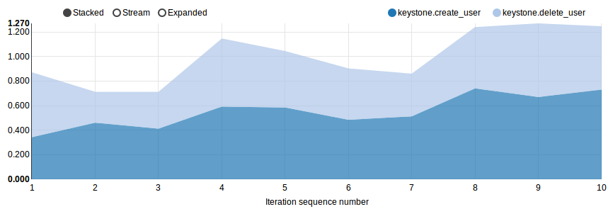

Distribution
~~~~~~~~~~~~

`Distribution <#distribution>`_ for atomic actions durations

Tab «Scenario Data»
-------------------

This tab only appears if workload provides some custom output via method
*Scenario.add_output()*.

Aggregated
~~~~~~~~~~

This shows charts with data aggregated from all iterations.
This means that each X axis point represents an iteration, so each iteration
provided some values that are aggregated into charts or tables.

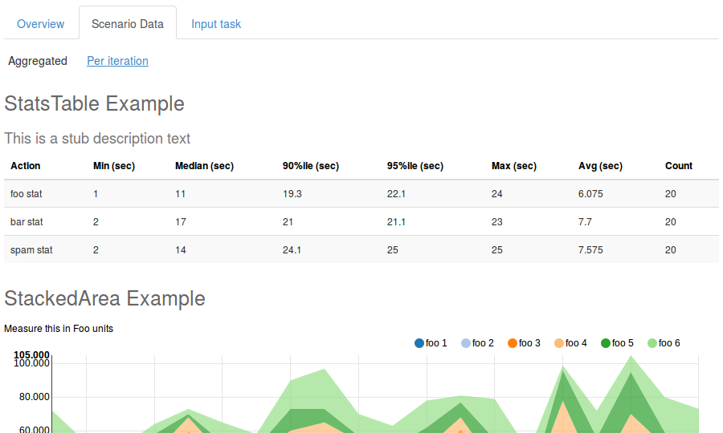

Per iteration
~~~~~~~~~~~~~

Each iteration can create its own, complete charts and tables.

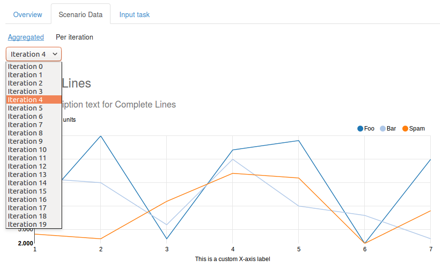

Tab «Failures»
--------------

Complete information about exceptions raised during the workload run

**Iteration**
 Number of iteration where exception is occured

**Exception type**
 Type of raised Exception subclass

**Exception message**
 Message delivered by the exception

Click on a row expands it with exception traceback.

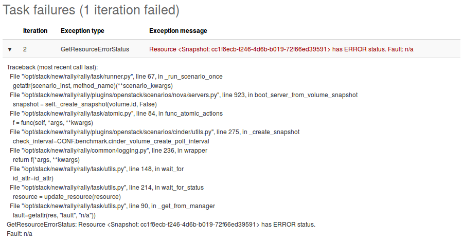

Tab «Input Task»
----------------

This shows JSON for input file which can be used to run current workload.

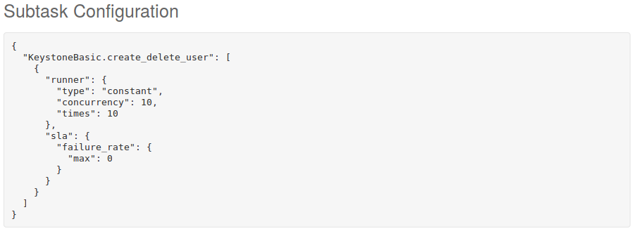

Trends Report
=============

If same workload is run several times, some results of these runs can be compared.
Compared metrics are ssuccess rate (percent of successful iterations) and statistics for durations.

How to generate trends report
-----------------------------

Use command *rally task trends* with given tasks UUIDs and/or tasks results JSON files
and the name of desired output file.

Example:

.. code-block:: shell

  $ rally task trends --tasks 6f63d9ec-eecd-4696-8e9c-2ba065c68535 a5737eba-a204-43d6-a262-d5ea4b0065da --out trends.html

What is an order of workload runs?
----------------------------------

Workload run number in shown on charts X axis, the order of runs is exactly as
it comes from tasks data in the moment of report generation.

Trends overview
---------------

.. image:: ./images/Report-Trends-Overview.png

If workload has been actually run only once
-------------------------------------------

That is obvious that it is not possible to have trend for a single value.
There should be at least two workload runs to make results comparison possible.
So in this case there is only a help message displayed.

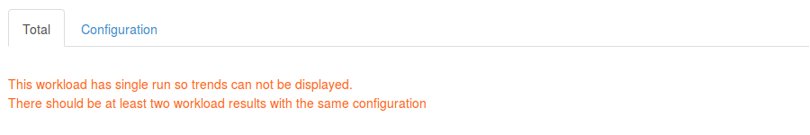

Tab «Total»
-----------

Total durations
~~~~~~~~~~~~~~~

Shows workload `load_duration <#load-duration>`_ statistics trends.

Total success rate
~~~~~~~~~~~~~~~~~~

Shows trends for percent of successful iterations

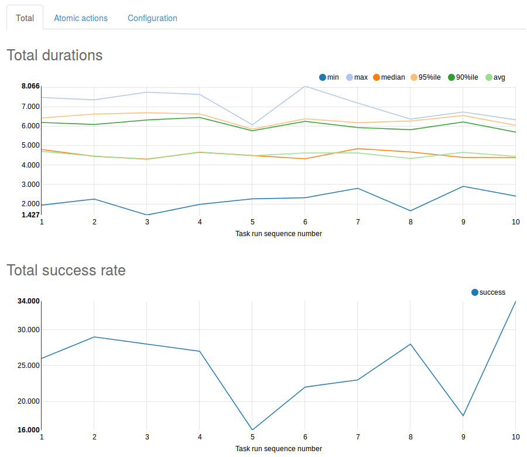

Tab «Atomic actions»
--------------------

Statistics trends for atomic actions durations.
Charts are same as for total durations.

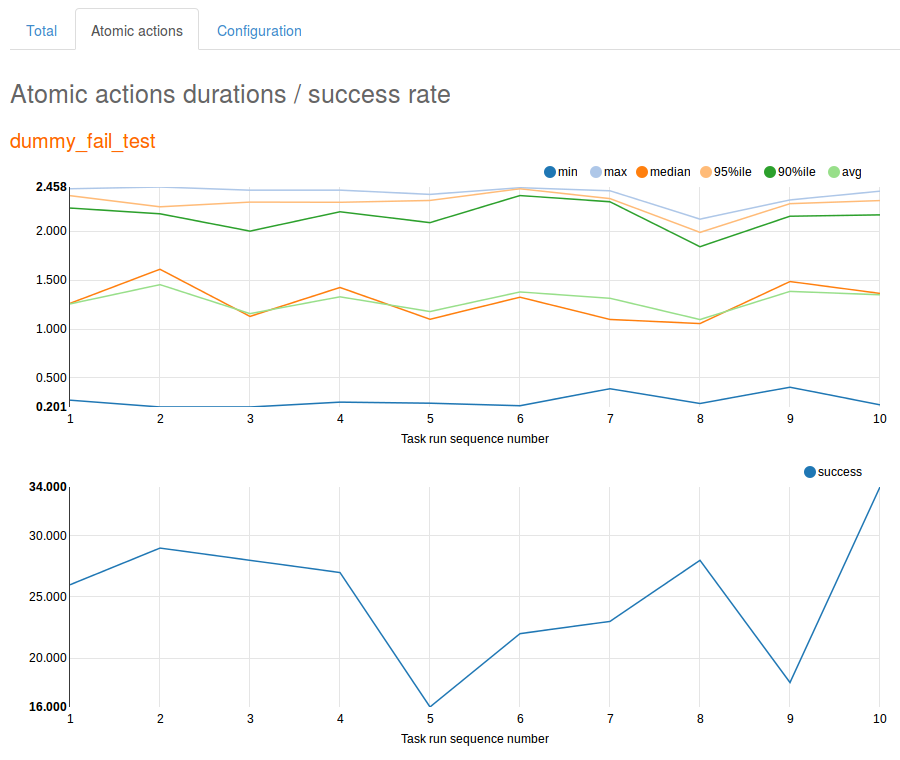

Tab «Configuration»
-------------------

Here is a configuration JSON for current workload.

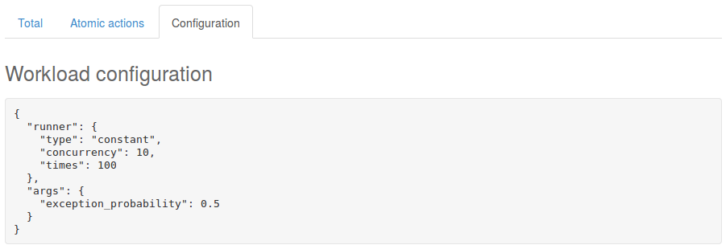
