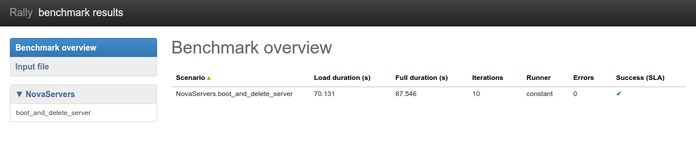
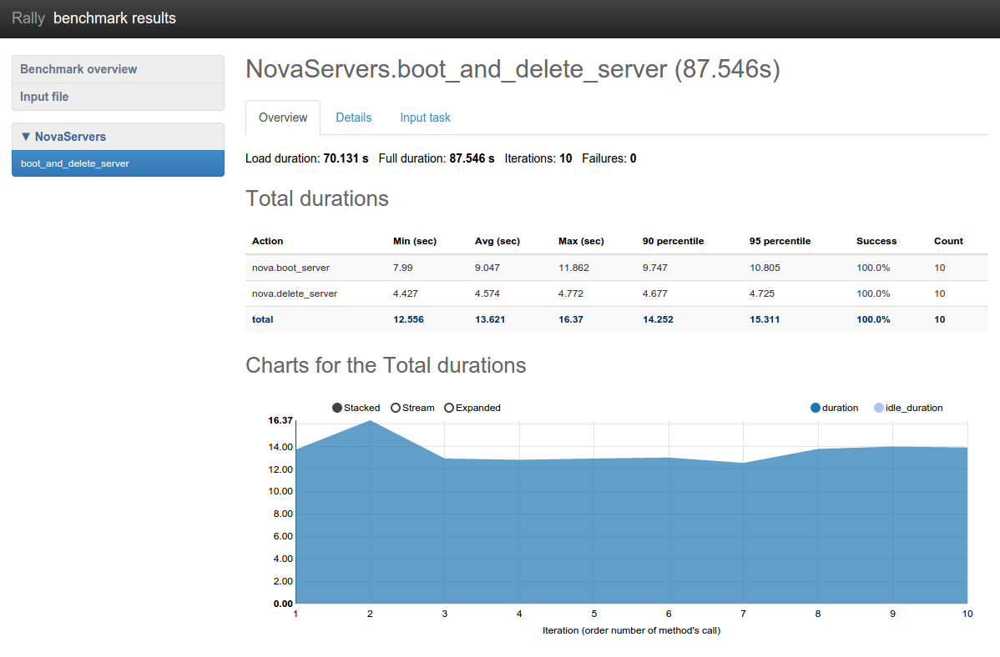
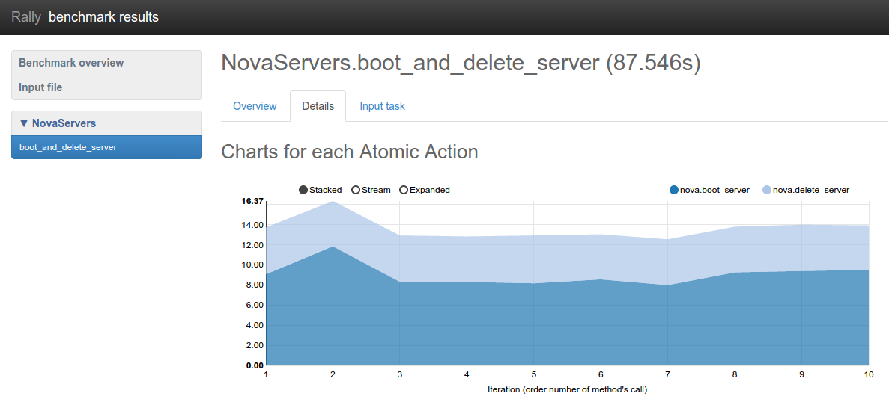

..
      Copyright 2015 Mirantis Inc. All Rights Reserved.

      Licensed under the Apache License, Version 2.0 (the "License"); you may
      not use this file except in compliance with the License. You may obtain
      a copy of the License at

          http://www.apache.org/licenses/LICENSE-2.0

      Unless required by applicable law or agreed to in writing, software
      distributed under the License is distributed on an "AS IS" BASIS, WITHOUT
      WARRANTIES OR CONDITIONS OF ANY KIND, either express or implied. See the
      License for the specific language governing permissions and limitations
      under the License.

.. _tutorial_step_1_setting_up_env_and_running_benchmark_from_samples:

Step 1. Setting up the environment and running a benchmark from samples
=======================================================================

.. contents::
   :local:

In this demo, we will show how to perform some basic operations in Rally, such as registering an OpenStack cloud, benchmarking it and generating benchmark reports.

We assume that you have a :ref:`Rally installation <tutorial_step_0_installation>` and an already existing OpenStack deployment with Keystone available at *<KEYSTONE_AUTH_URL>*.

Registering an OpenStack deployment in Rally
--------------------------------------------

First, you have to provide Rally with an OpenStack deployment it is going to benchmark. This should be done either through `OpenRC files <http://docs.openstack.org/user-guide/content/cli_openrc.html>`_ or through deployment `configuration files <https://github.com/openstack/rally/tree/master/samples/deployments>`_. In case you already have an *OpenRC*, it is extremely simple to register a deployment with the *deployment create* command:

.. code-block:: console

   $ . openrc admin admin
   $ rally deployment create --fromenv --name=existing
   +--------------------------------------+----------------------------+------------+------------------+--------+
   | uuid                                 | created_at                 | name       | status           | active |
   +--------------------------------------+----------------------------+------------+------------------+--------+
   | 28f90d74-d940-4874-a8ee-04fda59576da | 2015-01-18 00:11:38.059983 | existing   | deploy->finished |        |
   +--------------------------------------+----------------------------+------------+------------------+--------+
   Using deployment : <Deployment UUID>
   ...

Alternatively, you can put the information about your cloud credentials into a JSON configuration file (let's call it `existing.json <https://github.com/openstack/rally/blob/master/samples/deployments/existing.json>`_). The *deployment create* command has a slightly different syntax in this case:

.. code-block:: console

   $ rally deployment create --file=existing.json --name=existing
   +--------------------------------------+----------------------------+------------+------------------+--------+
   | uuid                                 | created_at                 | name       | status           | active |
   +--------------------------------------+----------------------------+------------+------------------+--------+
   | 28f90d74-d940-4874-a8ee-04fda59576da | 2015-01-18 00:11:38.059983 | existing   | deploy->finished |        |
   +--------------------------------------+----------------------------+------------+------------------+--------+
   Using deployment : <Deployment UUID>
   ...

Note the last line in the output. It says that the just created deployment is now used by Rally; that means that all the benchmarking operations from now on are going to be performed on this deployment. Later we will show how to switch between different deployments.

Finally, the *deployment check* command enables you to verify that your current deployment is healthy and ready to be benchmarked:

.. code-block:: console

   $ rally deployment check
   keystone endpoints are valid and following services are available:
   +----------+----------------+-----------+
   | services | type           | status    |
   +----------+----------------+-----------+
   | cinder   | volume         | Available |
   | cinderv2 | volumev2       | Available |
   | ec2      | ec2            | Available |
   | glance   | image          | Available |
   | heat     | orchestration  | Available |
   | heat-cfn | cloudformation | Available |
   | keystone | identity       | Available |
   | nova     | compute        | Available |
   | novav21  | computev21     | Available |
   | s3       | s3             | Available |
   +----------+----------------+-----------+

Benchmarking
------------

Now that we have a working and registered deployment, we can start benchmarking it. The sequence of benchmarks to be launched by Rally should be specified in a *benchmark task configuration file* (either in *JSON* or in *YAML* format). Let's try one of the sample benchmark tasks available in `samples/tasks/scenarios <https://github.com/openstack/rally/tree/master/samples/tasks/scenarios>`_, say, the one that boots and deletes multiple servers (*samples/tasks/scenarios/nova/boot-and-delete.json*):

.. code-block:: json

    {
        "NovaServers.boot_and_delete_server": [
            {
                "args": {
                    "flavor": {
                        "name": "m1.tiny"
                    },
                    "image": {
                        "name": "^cirros.*uec$"
                    },
                    "force_delete": false
                },
                "runner": {
                    "type": "constant",
                    "times": 10,
                    "concurrency": 2
                },
                "context": {
                    "users": {
                        "tenants": 3,
                        "users_per_tenant": 2
                    }
                }
            }
        ]
    }

To start a benchmark task, run the task start command (you can also add the *-v* option to print more logging information):

.. code-block:: console

    $ rally task start samples/tasks/scenarios/nova/boot-and-delete.json
    --------------------------------------------------------------------------------
     Preparing input task
    --------------------------------------------------------------------------------

    Input task is:
    <Your task config here>

    --------------------------------------------------------------------------------
     Task  6fd9a19f-5cf8-4f76-ab72-2e34bb1d4996: started
    --------------------------------------------------------------------------------

    Benchmarking... This can take a while...

    To track task status use:

      rally task status
      or
      rally task detailed

    --------------------------------------------------------------------------------
     Task 6fd9a19f-5cf8-4f76-ab72-2e34bb1d4996: finished
    --------------------------------------------------------------------------------

    test scenario NovaServers.boot_and_delete_server
    args position 0
    args values:
    {u'args': {u'flavor': {u'name': u'm1.tiny'},
               u'force_delete': False,
               u'image': {u'name': u'^cirros.*uec$'}},
     u'context': {u'users': {u'project_domain': u'default',
                             u'resource_management_workers': 30,
                             u'tenants': 3,
                             u'user_domain': u'default',
                             u'users_per_tenant': 2}},
     u'runner': {u'concurrency': 2, u'times': 10, u'type': u'constant'}}
    +--------------------+-----------+-----------+-----------+---------------+---------------+---------+-------+
    | action             | min (sec) | avg (sec) | max (sec) | 90 percentile | 95 percentile | success | count |
    +--------------------+-----------+-----------+-----------+---------------+---------------+---------+-------+
    | nova.boot_server   | 7.99      | 9.047     | 11.862    | 9.747         | 10.805        | 100.0%  | 10    |
    | nova.delete_server | 4.427     | 4.574     | 4.772     | 4.677         | 4.725         | 100.0%  | 10    |
    | total              | 12.556    | 13.621    | 16.37     | 14.252        | 15.311        | 100.0%  | 10    |
    +--------------------+-----------+-----------+-----------+---------------+---------------+---------+-------+
    Load duration: 70.1310448647
    Full duration: 87.545541048

    HINTS:
    * To plot HTML graphics with this data, run:
        rally task report 6fd9a19f-5cf8-4f76-ab72-2e34bb1d4996 --out output.html

    * To get raw JSON output of task results, run:
        rally task results 6fd9a19f-5cf8-4f76-ab72-2e34bb1d4996

    Using task: 6fd9a19f-5cf8-4f76-ab72-2e34bb1d4996

Note that the Rally input task above uses *regular expressions* to specify the image and flavor name to be used for server creation, since concrete names might differ from installation to installation. If this benchmark task fails, then the reason for that might a non-existing image/flavor specified in the task. To check what images/flavors are available in the deployment you are currently benchmarking, you might use the *rally show* command:

.. code-block:: console

   $ rally show images
   +--------------------------------------+-----------------------+-----------+
   |                 UUID                 |          Name         |  Size (B) |
   +--------------------------------------+-----------------------+-----------+
   | 8dfd6098-0c26-4cb5-8e77-1ecb2db0b8ae |  CentOS 6.5 (x86_64)  | 344457216 |
   | 2b8d119e-9461-48fc-885b-1477abe2edc5 | CirrOS 0.3.4 (x86_64) |  13287936 |
   +--------------------------------------+-----------------------+-----------+

   $ rally show flavors

   Flavors for user `admin` in tenant `admin`:
   +----+-----------+-------+----------+-----------+-----------+
   | ID | Name      | vCPUs | RAM (MB) | Swap (MB) | Disk (GB) |
   +----+-----------+-------+----------+-----------+-----------+
   | 1  | m1.tiny   | 1     | 512      |           | 1         |
   | 2  | m1.small  | 1     | 2048     |           | 20        |
   | 3  | m1.medium | 2     | 4096     |           | 40        |
   | 4  | m1.large  | 4     | 8192     |           | 80        |
   | 5  | m1.xlarge | 8     | 16384    |           | 160       |
   +----+-----------+-------+----------+-----------+-----------+

Report generation
-----------------

One of the most beautiful things in Rally is its task report generation mechanism. It enables you to create illustrative and comprehensive HTML reports based on the benchmarking data. To create and open at once such a report for the last task you have launched, call:

.. code-block:: bash

   rally task report --out=report1.html --open

This will produce an HTML page with the overview of all the scenarios that you've included into the last benchmark task completed in Rally (in our case, this is just one scenario, and we will cover the topic of multiple scenarios in one task in :ref:`the next step of our tutorial <tutorial_step_2_input_task_format>`):

This aggregating table shows the duration of the load produced by the corresponding scenario (*"Load duration"*), the overall benchmark scenario execution time, including the duration of environment preparation with contexts (*"Full duration"*), the number of iterations of each scenario (*"Iterations"*), the type of the load used while running the scenario (*"Runner"*), the number of failed iterations (*"Errors"*) and finally whether the scenario has passed certain Success Criteria (*"SLA"*) that were set up by the user in the input configuration file (we will cover these criteria in :ref:`one of the next steps <tutorial_step_4_adding_success_criteria_for_benchmarks>`).

By navigating in the left panel, you can switch to the detailed view of the benchmark results for the only scenario we included into our task, namely **NovaServers.boot_and_delete_server**:

This page, along with the description of the success criteria used to check the outcome of this scenario, shows more detailed information and statistics about the duration of its iterations. Now, the *"Total durations"* table splits the duration of our scenario into the so-called **"atomic actions"**: in our case, the **"boot_and_delete_server"** scenario consists of two actions - **"boot_server"** and **"delete_server"**. You can also see how the scenario duration changed throughout its iterations in the *"Charts for the total duration"* section. Similar charts, but with atomic actions detailed are on the *"Details"* tab of this page:

Note that all the charts on the report pages are very dynamic: you can change their contents by clicking the switches above the graph and see more information about its single points by hovering the cursor over these points.

Take some time to play around with these graphs
and then move on to :ref:`the next step of our tutorial <tutorial_step_2_input_task_format>`.
