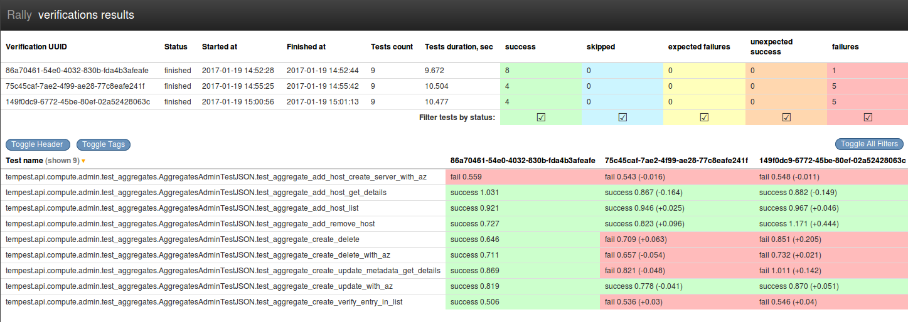
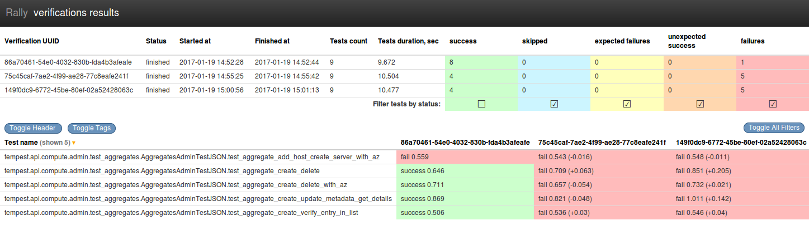
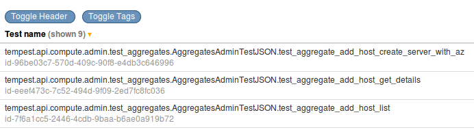
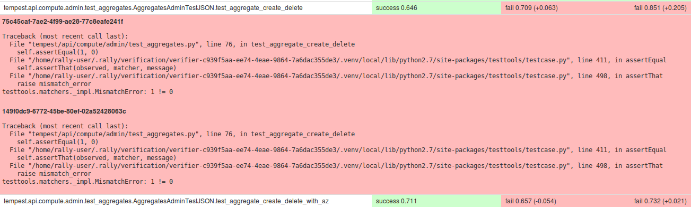
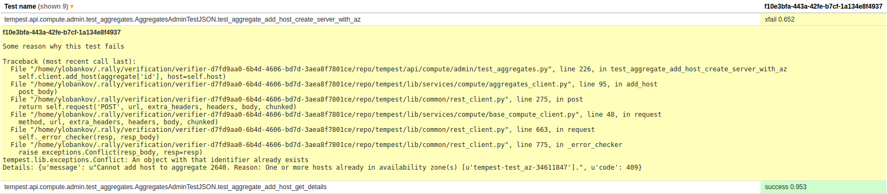

..
      Licensed under the Apache License, Version 2.0 (the "License"); you may
      not use this file except in compliance with the License. You may obtain
      a copy of the License at

          http://www.apache.org/licenses/LICENSE-2.0

      Unless required by applicable law or agreed to in writing, software
      distributed under the License is distributed on an "AS IS" BASIS, WITHOUT
      WARRANTIES OR CONDITIONS OF ANY KIND, either express or implied. See the
      License for the specific language governing permissions and limitations
      under the License.

.. _verification-reports:

====================
Verification reports
====================

Rally stores all verifications results in its DataBase so that you can access
and process results at any time. No matter what verifier you use, results will
be stored in a unified way and reports will be unified too.

We support several types of reports out of the
box: :include-var:`rally.cli.commands.verify.DEFAULT_REPORT_TYPES`; but our
reporting system is pluggable so that you can write your own plugin to build
some specific reports or to export results to the specific system (see
:ref:`howto-add-new-reporting-mechanism` for more details`).

.. contents::
  :depth: 2
  :local:

HTML reports
------------

HTML report is the most convenient type of reports. It includes as much as
possible useful information about Verifications.

Here is an example of HTML report for 3 verifications.
It was generated by next command:

.. code-block:: console

    $ rally verify report --uuid <uuid-1> <uuid-2> <uuid-3> --type html \
      --to ./report.html

The report consists of two tables.

First one is a summary table. It includes base information about
verifications: UUIDs; numbers of tests; when they were launched; statuses; etc.
Also, you can find detailed information grouped by tests statuses at the right
part of the table.

If the size (height) of the summary table seems too large for you and hinders
to see more tests results, you can push "Toggle Header" button.

The second table contains actual verifications results. They are grouped by
tests names. The result of the test for particular verification overpainted by
one of the next colours:

* *Red* - It means that test has "failed" status
* *Orange* - It is "unexpected success". Most of the parsers calculates it just
  like failure
* *Green* - Everything is ok. The test succeeded.
* *Yellow* - It is "expected failure".
* *Light Blue* - Test is skipped. It is not good and not bad

Several verifications comparison is a default embedded behaviour of reports.
The difference between verifications is displayed in brackets after actual
test duration. Sign **+** means that current result is bigger that standard by
the number going after the sign. Sign **-** is an opposite to **+**. Please,
note that all diffs are comparisons with the first verification in a row.

Filtering results
"""""""""""""""""

You can filter tests by setting or removing a mark from check box of the
particular status column of the summary table.

Tests Tags
""""""""""

Some of the tests tools support tests tagging. It can be used for setting
unique IDs, groups, etc. Usually, such tags are included in test name. It is
inconvenient and Rally stores tags separately. By default they are hidden, but
if you push "Toggle tags" button, they will be displayed under tests names.

Tracebacks & Reasons
""""""""""""""""""""

Tests with "failed" and "expected failure" statuses have tracebacks of
failures. Tests with "skipped", "expected failure", "unexpected success" status
has "reason" of events. By default, both tracebacks and reasons are hidden,
but you can show them by clicking on the appropriate test.

Plugins Reference for all out-of-the-box reporters
--------------------------------------------------

.. generate_plugin_reference::
  :base_cls: Verification Reporter
