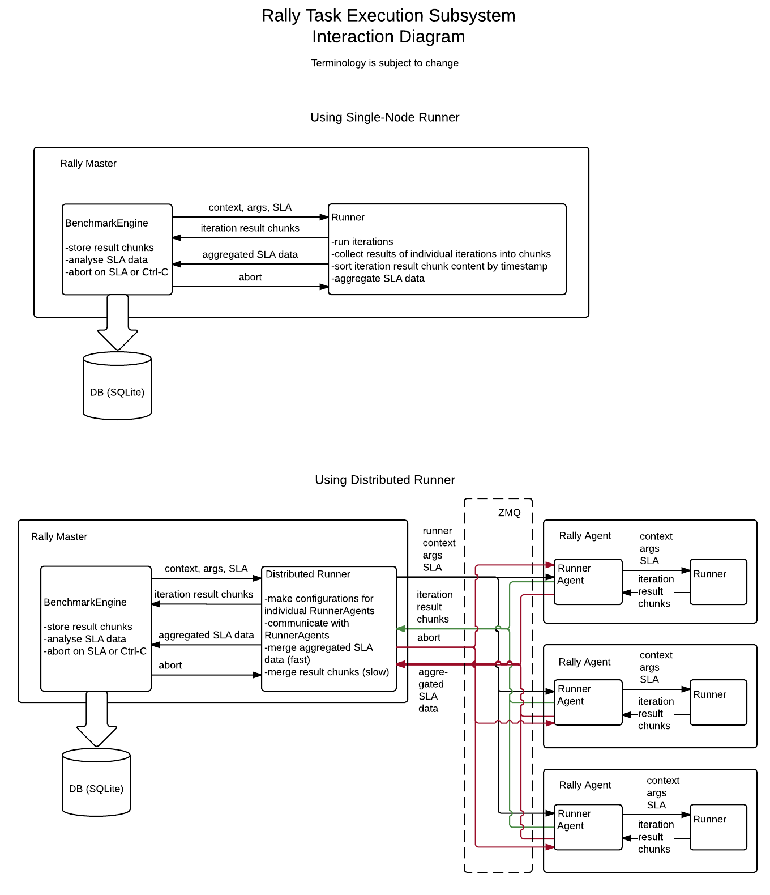

..
 This work is licensed under a Creative Commons Attribution 3.0 Unported
 License.

 http://creativecommons.org/licenses/by/3.0/legalcode

..
 This template should be in ReSTructured text. The filename in the git
 repository should match the launchpad URL, for example a URL of
 https://blueprints.launchpad.net/heat/+spec/awesome-thing should be named
 awesome-thing.rst .  Please do not delete any of the sections in this
 template.  If you have nothing to say for a whole section, just write: None
 For help with syntax, see http://sphinx-doc.org/rest.html
 To test out your formatting, see http://www.tele3.cz/jbar/rest/rest.html

============================
Implement Distributed Runner
============================

We need a Distributed Runner in Rally that will run tasks on many nodes
simultaneously.

Problem description
===================

Currently there are several runners in Rally, but they all can only run on
the same host that Rally itself runs on. It limits test load that Rally can
generate. In some cases required load can not be generated from one host.

In current implementation Runner object runs actual subtask and generates test
results while TaskEngine via ResultConsumer retrieves these results,
checks them against specified SLA and stores in DB.

There are several aspects that should be kept in mind when reasoning about
distributed load generation:

- Even one active runner is able to produce significant amounts of result data
  so that TaskEngine could barely process it in time. We assume that
  the single TaskEngine instance definitely will not be able to process
  several streams of raw test result data from several simultaneous runners.

- We need test results to be checked against SLA as soon as possible so that
  we could stop load generation on SLA violation immediately (or close to)
  and protect the environment being tested. On the other hand we need results
  from all runners to be analysed, i.e. checking SLA on a single runner is not
  enough.

- Since we expect long task duration we want to provide to user at least
  partial information about task execution as soon as possible.

Proposed change
===============

It is proposed to introduce two new component, RunnerAgent and a new plugin
of runner type, DistributedRunner, and refactor existing components,
TaskEngine, Runner and SLA, so that overall interaction will look as follows.

1. TaskEngine

    - create subtask context
    - create instance of Runner
    - run Runner.run() with context object and info about sceanario
    - in separated thread consume iteration result chunks & SLA from Runner
    - delete context

2. RunnerAgent
    - is executed on agent nodes
    - runs Runner for received task iterations with given context and args
    - collects iteration result chunks, stores them on local filesystem,
      sends them on request to DistributedRunner
    - aggregates SLA data and periodically sends it to DistributedRunner
    - stops Runner on receive of corresponding message

3. DistributedRunner
    - is a regular plugin of Runner type
    - communicates with remote RunnerAgents wia message queue (ZeroMQ)
    - provides context, args and SLA to RunnerAgents
    - distributes task iterations to RunnerAgents
    - aggregates SLA data from RunnerAgents
    - merges chunks of task result data

It is supposed to use separate communication channels for task results
and SLA data.
    - SLA data is sent periodically (e.g. once per second) for iterations
      that are already finished.
    - Task results are collected into chunks and stored locally by
      RunnerAgent and only send on request.

Alternatives
------------

No way

Implementation
==============

Assignee(s)
-----------

Primary assignee:
  Illia Khudoshyn

Work Items
----------

- Refactor current SLA mechanism to support aggregated SLA data

- Refactor current Runner base class
    - collect iteration results into chunks, ordered by timestamp
    - perform local SLA checks
    - aggregate SLA data

- Refactor TaskEngine to reflect changes in Runner
    - operate chunks of ordered test results rather then stream of raw
      result items
    - apply SLA checks to aggregated SLA data
    - analyze SLA data and consume test results in separate threads

- Develop infrastructure that will allow multi-node Rally configuration
  and run

- Implement RunnerAgent
    - run Runner
    - cache prepared chunks of iteration results
    - comunicate via ZMQ with DistributedRunner(send task results
      and SLA on separate channels)
    - terminate Runner on 'stop' command from TaskEngine

- Implement DistributedRunner that will
    - feed tasks to RunnerAgents
    - receive chunks of result data from RunnerAgents, merge it and
      provide merged data to TaskEngine
    - receive aggregated SLA data from RunnerAgents, merge it
      and provide data to TaskEngine
    - translate 'stop' command from TaskEngine to RunnerAgents

Dependencies
============

- DB model refactoring (boris-42)
- Report generation refactoring (amaretsky)
